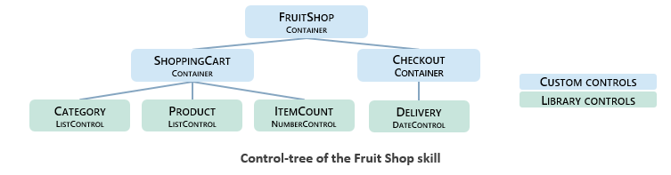
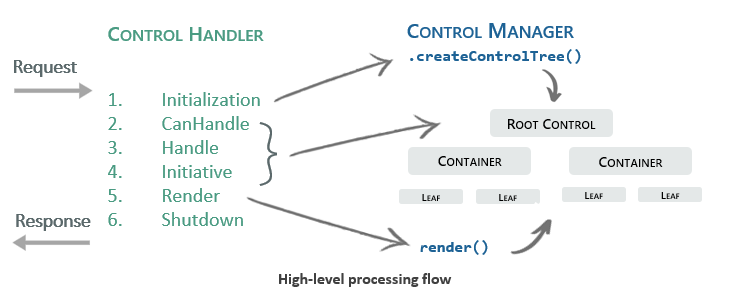
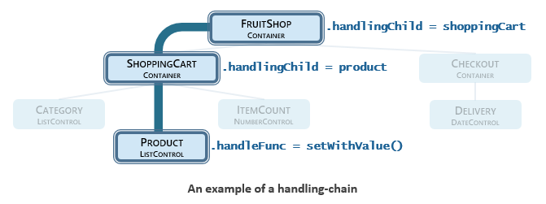

<!-- markdownlint-disable MD029 -->
<!-- markdownlint-disable MD041 -->
<!-- markdownlint-disable MD033 -->

<h1>User Guide - Controls Framework (Beta) </h3>


The Controls Framework for ASK-SDK is offered as a beta and may change as we receive
feedback and iterate on the feature. If you have questions or feedback please create
issues directly in the github repository.

This guide assumes familiarity with building Custom Skills for Alexa using
the ASK-SDK v2 for Node.js.  For background information on building skills and getting
started with the ASK-SDK for Node.js please see [Understanding Custom
Skills](https://developer.amazon.com/en-US/docs/alexa/custom-skills/understanding-custom-skills.html)
and [Using the ASK SDKs to create Alexa
Skills](https://developer.amazon.com/en-US/docs/alexa/quick-reference/use-sdks-quick-reference.html)
on the Amazon developer portal.

For per-class and per-method documentation, please see the [Technical
documentation](https://ask-sdk-controls-typedoc.s3.amazonaws.com/index.html).

<h1>Table of Contents</h3>

<!-- spellchecker: disable -->
<!-- TOC -->

- [1. Overview](#1-overview)
  - [1.1. Purpose of the Controls Framework](#11-purpose-of-the-controls-framework)
  - [1.2. How does it work?](#12-how-does-it-work)
- [2. Getting started](#2-getting-started)
  - [2.1. Tool chain for developing a skill with Controls](#21-tool-chain-for-developing-a-skill-with-controls)
  - [2.2. Javascript or Typescript?](#22-javascript-or-typescript)
  - [2.3. Getting diagnostics and tracking the runtime call flow](#23-getting-diagnostics-and-tracking-the-runtime-call-flow)
  - [2.4. Creating a launch configuration for vscode launch.json](#24-creating-a-launch-configuration-for-vscode-launchjson)
  - [2.5. Run the regression tests](#25-run-the-regression-tests)
  - [2.6. Build the interaction model for the skill](#26-build-the-interaction-model-for-the-skill)
  - [2.7. Get the source code](#27-get-the-source-code)
  - [2.8. Run the Controls Framework regression tests](#28-run-the-controls-framework-regression-tests)
  - [2.9. Your first skill using controls](#29-your-first-skill-using-controls)
- [3. Exploring the HelloWorld Controls skill](#3-exploring-the-helloworld-controls-skill)
  - [3.1. Code overview](#31-code-overview)
  - [3.2. Interaction model](#32-interaction-model)
  - [3.3. Deploying Hello World](#33-deploying-hello-world)
  - [3.4. Live testing with local debugging](#34-live-testing-with-local-debugging)
  - [3.5. Running the regression tests](#35-running-the-regression-tests)
- [4. Exploring the FruitShop demo skill](#4-exploring-the-fruitshop-demo-skill)
  - [4.1. Code overview](#41-code-overview)
  - [4.2. Category control](#42-category-control)
  - [4.3. Checkout control](#43-checkout-control)
  - [4.4. Shopping cart control](#44-shopping-cart-control)
  - [4.5. Root control](#45-root-control)
  - [4.6. Interaction model](#46-interaction-model)
  - [4.7. Regression tests](#47-regression-tests)
  - [4.8. Sidebar: Reusable leaf controls, and purity](#48-sidebar-reusable-leaf-controls-and-purity)
- [5. Developing with Controls](#5-developing-with-controls)
  - [5.1. What is a Control?](#51-what-is-a-control)
  - [5.2. What inputs does a Control respond to?](#52-what-inputs-does-a-control-respond-to)
  - [5.3. Runtime flow](#53-runtime-flow)
    - [5.3.1. Initialization phase](#531-initialization-phase)
    - [5.3.2. CanHandle phase](#532-canhandle-phase)
    - [5.3.3. Handle phase](#533-handle-phase)
    - [5.3.4. Initiative phase](#534-initiative-phase)
    - [5.3.5. Render phase](#535-render-phase)
    - [5.3.6. Shutdown phase](#536-shutdown-phase)
    - [5.3.7. Ending the session](#537-ending-the-session)
    - [5.3.8. Handling internal errors](#538-handling-internal-errors)
  - [5.4. System Acts](#54-system-acts)
    - [5.4.1. Content acts](#541-content-acts)
    - [5.4.2. Initiative acts](#542-initiative-acts)
  - [5.5. State management](#55-state-management)
    - [5.5.1. Sharing information with the parent control and the application](#551-sharing-information-with-the-parent-control-and-the-application)
    - [5.5.2. Implementing the logic of a Control](#552-implementing-the-logic-of-a-control)
      - [5.5.2.1. Implementing Control.canHandle](#5521-implementing-controlcanhandle)
      - [5.5.2.2. Implementing Control.handle](#5522-implementing-controlhandle)
      - [5.5.2.3. Implementing Control.canTakeInitiative](#5523-implementing-controlcantakeinitiative)
      - [5.5.2.4. Implementing Control.takeInitiative](#5524-implementing-controltakeinitiative)
      - [5.5.2.5. Implementing Control.renderAct](#5525-implementing-controlrenderact)
    - [5.5.3. Additional notes about container controls](#553-additional-notes-about-container-controls)
  - [5.6. Interfacing with state serialization during Shutdown phase](#56-interfacing-with-state-serialization-during-shutdown-phase)
  - [5.7. Interaction Model](#57-interaction-model)
    - [5.7.1. Shareable intents](#571-shareable-intents)
    - [5.7.2. What kinds of utterances are supported by standard schemas](#572-what-kinds-of-utterances-are-supported-by-standard-schemas)
      - [5.7.2.1. Feedback slot type](#5721-feedback-slot-type)
      - [5.7.2.2. Action slot type](#5722-action-slot-type)
      - [5.7.2.3. Target slot type](#5723-target-slot-type)
      - [5.7.2.4. Head, Tail and Preposition](#5724-head-tail-and-preposition)
    - [5.7.3. Sample utterance shapes for Control Intents](#573-sample-utterance-shapes-for-control-intents)
    - [5.7.4. Associating targets and actions to controls](#574-associating-targets-and-actions-to-controls)
    - [5.7.5. Building the interaction model](#575-building-the-interaction-model)
    - [5.7.6. What utterance shapes are covered by Control Intents](#576-what-utterance-shapes-are-covered-by-control-intents)
    - [5.7.7. When to introduce new Intents](#577-when-to-introduce-new-intents)
- [6. Additional topics](#6-additional-topics)
  - [6.1. Migrating from the Custom Skills Dialog Interface](#61-migrating-from-the-custom-skills-dialog-interface)
  - [6.2. Internationalization and Localization](#62-internationalization-and-localization)
    - [6.2.1. Creating a localized interaction model](#621-creating-a-localized-interaction-model)
    - [6.2.2. Using localized data at runtime.](#622-using-localized-data-at-runtime)
- [7. Reference](#7-reference)

<!-- /TOC -->
<!-- spellchecker: enable -->

# 1. Overview

## 1.1. Purpose of the Controls Framework

The Controls Framework allows developers to implement Custom Skills that offer rich
mixed-initiative and multi-modal experiences.

One specific goal of the framework is to encourage the development of re-usable
components, called Controls, that can be shared between projects and between developers.
The framework includes a library of reusable Controls for some of the most common tasks
that developers face. Developers can easily create new Controls and build new high-level
Controls from low-level ones.

Another goal is to help developers to follow the best practices of conversational design
and to provide a natural way to implement that concepts of [situational design](https://developer.amazon.com/en-US/alexa/alexa-skills-kit/situational-design).

Finally, the Controls framework is designed to integrate seamlessly with existing skills
written using the ASK-SDK v2 for Node.js.

## 1.2. How does it work?

The Controls Framework is a Node.js package that is used in conjunction with the ASK-SDK
v2 for Node.js and the ASK suite of tools (ASK CLI v2, ASK-SDK extension for Visual Studio
Code, Alexa Developer Portal).

The central concept is that a skill can be built from *Controls* that encapsulate portions of
the skill's state and dialog logic such that controls can be developed independently and
then composed together to build an entire skill. The framework provides patterns for
building and grouping controls and it defines the rules regarding how controls should
interact.

The framework provides a runtime (`ControlHandler`) that can be used as a standalone
`RequestHandler` or incorporated into an existing one.  The `ControlHandler` drives the
processing of each turn as a sequence of phases:

1. ***Initialization phase***: Constructs a tree of controls and deserializes their state.
2. ***'Can Handle' phase***: Determines a specific chain of controls in the tree that will
   handle the input.
3. ***Handle phase***: Walks the handling chain to make state updates, call business
   functions, and produce results for the user.
4. ***Initiative phase (if needed)***. Determines a chain of control to *take the
   initiative* and continue the dialog. This phase runs if the handle phase did not
   take or continue the initiative.
5. ***Render phase*** Transforms the results into a complete user-facing response that
   includes speech, APL or both.
6. ***Shutdown phase*** Collects and serializes the state of each control and returns
   the complete response.

---

# 2. Getting started

Install the ASK CLI v2. If you already have the ASK CLI v1, please see [the CLI
migration
guide](https://developer.amazon.com/en-US/docs/alexa/smapi/ask-cli-v1-to-v2-migration-guide.html)


```bash
npm i -g ask-cli
```

Create a new skill based on the `Hello, World! (with Controls)` demo skill.  When choosing
a hosting method please note that with the new local debugging support you do not need to
deploy your skill to test a skill end-to-end with a device - the code can simply run on
your local machine and attached to the VScode debugger. If you are unsure which hosting
method to choose, we recommend 'Alexa-hosted' which is free and easy to use. See [Creating
new skill with
ASK-CLI](https://developer.amazon.com/en-US/docs/alexa/smapi/ask-cli-intro.html#create-new-skill)
and [Building an Alexa-hosted
skill](https://developer.amazon.com/en-US/docs/alexa/hosted-skills/build-a-skill-end-to-end-using-an-alexa-hosted-skill.html)
for more information.

```bash
ask new
> choose a skill hosting method.
> select NodeJS
> select Hello World (with Controls)
```

Install the Node.js dependencies for the skill, which includes the Controls Framework for
ASK-SDK

```bash
 cd lambda
 npm install
```

Either deploy your skill with `ask deploy` or set up local debugging (See section ["Live testing with local debugging"](#live-testing-with-local-debugging)).

Once your skill is ready for testing, use the testing page of the developer portal
(https://developer.amazon.com/alexa/console/ask/test/{SkillID}/development/en_US/) or `ask dialog` to test it out.

```text
U: Alexa, open Hello Controls
A: Hello! Welcome to your first Controls skill.
```

See the section 'Exploring the hello world skill' for a discussion of how the skill works.

Once you have taken a look around the Hello World, we recommend repeating the process with
the Fruit Shop demonstration skill to start exploring a more interesting skill. Section
'Exploring the Fruit shop skill' provides a discussion.

## 2.1. Tool chain for developing a skill with Controls

The workflow when using the Controls Framework will be largely the same as for any
Node.js skill that uses ASK-SDK v2 for Node.js.  We recommend using the following in your
tool-chain:

- Visual Studio Code
- Node.js v10.16 or higher
- Typescript v3.9 or higher
- ASK-SDK v2 for Node.js
- Alexa Skills Kit (ASK) Toolkit extension v2 for Visual Studio Code
- ASK local-debugging
- ASK-CLI v2
- Alexa developer portal (for testing your skill, including APL)
- ESLint (which supersedes TSLint)
- A regression test framework such as mocha + chai.

## 2.2. Javascript or Typescript?

Skills that use the Controls framework can be written in JavaScript or Typescript and
there is no functional or performance difference from the choice. The ASK-SDK dev team
uses TypeScript as we find that our personal productivity is greatly increased (roughly
2x-4x).  The benefits arise from superior intellisense, stronger linting rules, and from
finding bugs at edit & build time rather than at runtime.  If you haven't tried TypeScript
for skill building, we recommend you give it a try! Seriously :)

If you prefer JavaScript you may be interested to know that some of the benefits of
TypeScript can be brought to a pure JavaScript codebase. See [Migrating from
JavaScript](https://www.typescriptlang.org/docs/handbook/migrating-from-javascript.html)
and [Type Checking JavaScript
Files](https://www.typescriptlang.org/docs/handbook/type-checking-javascript-files.html)
at www.typescriptlang.org for more information.

## 2.3. Getting diagnostics and tracking the runtime call flow

The Controls Framework produces diagnostic information via the [Debug
package (npm)](https://www.npmjs.com/package/debug). To get maximum detail, set the following
environment variable.

```text
export DEBUG="error:*, warn:*, info:*, debug:*"
```

## 2.4. Creating a launch configuration for vscode (launch.json)

When running in Visual Studio Code, it is necessary to create a `launch.json` to provide targets for running the skill, running regression
tests and running the interaction-model builder.  See the `ide/` folder in the sample
skills for example launch commands.

## 2.5. Run the regression tests

You can run the regression tests for the sample skills at the command line:

```bash
cd lambda
npm run test
```

Alternatively, run the unit tests in vscode via the `Launch Tests` launch target described
above. In either case, set the `DEBUG` environment variable if you wish to see detailed
diagnostic output.

## 2.6. Build the interaction model for the skill

The Controls Framework provides APIs to create _interaction-model builder_ scripts that
extract data from Controls and merge with existing `model.json` files along with custom
programmatic modifications.  Each sample skill includes a `build_interaction_model.js`
script that is used to create the associated interaction model files.

The `build_interaction_model.js` script should be run before deploying or whenever changes
are made to skill code that would affect the interaction model. The output of the script
is a model.json file that can be diffed against the existing interaction model and then
copied across.  To run an interaction builder, invoke the script with Node.js:

```bash
cd lambda
node src/build_interaction_model.js
```

If you wish to launch the builder script in vscode, see the `ide/` folder for an example
launch.json file with suitable targets.

## 2.7. Get the source code

To get the Controls Framework source code for perusal or for development, clone the
ASK-SDK v2 github repo, and locate the Controls Framework project:

```bash
git clone https://github.com/alexa/alexa-skills-kit-sdk-for-nodejs/
cd alexa-skills-kit-sdk-for-nodejs/ask-sdk/ask-sdk-controls
```

To get the Controls Framework source code while developing your skill, install [`ask-sdk-controls`](https://www.npmjs.com/package/ask-sdk-controls) from npm

```bash
npm install -S ask-sdk-controls
```

## 2.8. Run the Controls Framework regression tests

The regression tests included in the Controls Framework are a good resource for learning.
One way to use them is to step through individual tests inside Visual Studio Code:

1. Clone the framework code.
2. Copy the launch.json from `./ide/vscode/launch.json` to `./vscode`.
3. Find an interesting test, mark it as `test.only()` then step into it with `F5` (Debug:
   Start Debugging)


## 2.9. Your first skill using controls

This section is a quick walk-through of the steps to create a skill using Controls. The
following sections will go in to the details.

The Controls framework provides a library of pre-made controls that offer solutions for
common interactions scenarios such as presenting a list of options to a user. These
controls include their own interaction models which can be merged with your existing
skill's interaction model.

As an example, we'll add a [ListControl](https://ask-sdk-controls-typedoc.s3.amazonaws.com/modules/_commoncontrols_listcontrol_listcontrol_.html) that asks users to select their favorite color to an existing skill:

1. Instantiate the ListControl within a custom
   [ControlManager](http://ask-sdk-controls-typedoc.s3-website-us-east-1.amazonaws.com/modules/_controls_controlmanager_.html).

    ```js
    // index.js

    const { ListControl, ControlManager, ControlHandler } = require('ask-sdk-controls');
    ...

    class SkillControlManager extends ControlManager {
      createControlTree() {
        const colorsListControl = new ListControl({
            prompts: {
                requestValue: "What is your favorite color?",
                valueSet: (act) => {
                    return `I'll remember your favorite color is ${act.state.value}`;
                }
            },
            listItemIDs: () => ["red", "green", "blue", "yellow", "purple"]
        });

        return colorsListControl;
      }
    }

    exports.handler = Alexa.SkillBuilders.custom()
      .addRequestHandlers(new ControlHandler(new SkillControlManager()))
      .lambda();
    ```

2. Create a `build_interaction_models.js` script to generate and merge the ListControl's interaction model with your skill's own interaction model:

    ```js
    const { ControlInteractionModelGenerator } = require('ask-sdk-controls');

    new ControlInteractionModelGenerator()
        .loadFromFile('./my-en-US.json') // load hand-written model, if needed
        .buildCoreModelForControls(new SkillControlManager())
        .buildAndWrite("./en-US-generated.json");
    ```

3. Run `build_interaction_models.js` script to build a new interaction model with one that includes the library control interaction models included:

    ```bash
    node ./build_interaction_model.js
    ```

4. Replace your skill package's interaction model with the generated version.

    ```bash
    mv ./en-US-generated.json ./skill-package/interactionModels/custom/en-US.json
    ```


# 3. Exploring the HelloWorld (Controls) skill

The _Hello World (Controls)_ skill is a minimal skill that uses the Controls framework, written in
JavaScript.  In response to a `LaunchRequest` it says hello and then closes the session.
See the "Getting Started" section for details on how to create a local copy of the Hello
World skill.

## 3.1. Code overview

```js
index.js:

1. const Alexa = require('ask-sdk-core');
2. const { InputUtil, ControlHandler, ControlManager, Control, LiteralContentAct } = require('ask-sdk-controls');
3.
4. class HelloControl extends Control {
5.    canHandle(input) {
6.        return InputUtil.isLaunchRequest(input);
7.    }
8.
9.    handle(input, resultBuilder) {
10.       resultBuilder.addAct(new LiteralContentAct(this, {promptFragment: 'Hello, world.'}));
11.       resultBuilder.endSession();
12.    }
13.}
14.
15. class HelloManager extends ControlManager {
16.    createControlTree() { return new HelloControl('rootControl'); }
17.}
18.
19. exports.handler = Alexa.SkillBuilders.custom()
20.    .addRequestHandlers(new ControlHandler(new HelloManager()))
21.    .lambda();
22. exports.HelloManager = HelloManager;
```

Points of interest:

- **Line 1**: The `ask-sdk-core` package is imported as usual.
- **Line 2**: New types are imported from the Controls Framework package.
- **Line 4**: Every Control implements the `IControl` interface and typically extends the
  `Control` abstract base class to obtain default functionality. In this skill there is
  one control: `HelloControl`.
- **Line 5-7**: This block indicates that this control can handle a LaunchRequest.
  The Controls Framework introduces patterns to dynamically choose between controls if
  more than one indicates that it can handle an input.
- **Line 9-12**: The `handle()` method is executed for a control that can handle an input
  _AND_ which has been chosen as the winner in cases where multiple controls can handle an
  input. Much more will be said about this!
- **Line 10**: The framework separates response logic from rendering. A _system act_ is a
  simple object representing "something to communicate to the user". In this case the
  `LiteralContentAct` is used to communicate some arbitrary literal content.  The
  framework defines various system acts that have precise purposes and developers can create new ones too.  System acts are an intermediate representation that are
  converted to a complete `Response` during the rendering phase; in this skill the default
  rendering logic is sufficient and causes the `LiteralContentAct` to add its literal
  content to the `Response.outputSpeech`.
- **Line 15**: A `ControlManager` is a high-level organizer authored by the skill
  developer. It interfaces directly with the framework's runtime (`ControlHandler`) and
  takes care of high-level behaviors.  One key task is to creates the *tree of controls*
  at the start of each turn. Here, the control tree comprises exactly one control.  Note
  that every control instance must have an id. Our control has `id = rootControl`.
- **Line 20**: The framework provides the `ControlHandler` which is a `RequestHandler`.
  The ControlHandler can be added just like any other `RequestHandler`.  Skills
  can freely mix-and-match regular request handlers with control handlers.
- **Line 19-21**: In total, these lines create a function that can be used as an
  entry-point by AWS Lambda.
- **Line 22**: This line exports the HelloManager for use in regression tests.

## 3.2. Interaction model

The Hello World skill needs an interaction model. Skills that use the Controls Framework
will generally build their interaction model using code, so we explore that here.  The
code is in `./build_interaction_model.js`.

```js
1. const { ControlInteractionModelGenerator, Logger } = require('ask-sdk-controls');
2.
3. new ControlInteractionModelGenerator()
4.   .withInvocationName('hello world')
5.   .addIntent({ name: 'AMAZON.StopIntent' })
6.   .addIntent({ name: 'AMAZON.NavigateHomeIntent' })
7.   .addIntent({ name: 'AMAZON.HelpIntent' })
8.   .addIntent({ name: 'AMAZON.CancelIntent' })
9.
10.    // Add a custom intent
11.    .addIntent({ name: 'HelloIntent', samples: [
12.        "Say hello",
13.        "Say hi"
14.    ]})
15.
16.    // Build and write
17.    .buildAndWrite('en-US-generated.json');
18.
19. console.log('Done. Wrote ./en-US-generated.json');
```

The main class is `ControlInteractionModelGenerator()` which provides the methods
necessary to build up an interaction model in memory then write it to disk. In a skill
with more interesting controls we will make use of
`ControlInteractionModelGenerator.buildCoreModelForControls()` to extract interaction
model content directly from the control tree but for HelloWorld that is not necessary.  If
you already have a `model.JSON` file, it can be loaded into the generator with
`ControlInteractionModelGenerator.loadFromFile()`.

On line 17, the output is written.  By convention, the output is directed to a temporary
file where it can be viewed and compared against the existing interaction model.  If
everything looks good, the generated file can be copied over as the new interaction model.

```bash
cp en-US-generated.json skill-package/interactionModels/custom/en-US.json
```

## 3.3. Deploying Hello World

The _Hello World (Controls)_ skill can be deployed into AWS Lambda or used directly via
local debugging.

The following will create a new skill in the your Alexa Developer Portal account and also
deploy the code to your AWS account.

```bash
ask deploy
```

After this completes you can test the skill in the Alexa Developer Portal

If you prefer to use Alexa Hosted skills, please create a hosted skill directly through
the Alexa Developer Portal, then update with the Hello World code and interaction model.

The next section describes running the live skill with no code deployment at all.

## 3.4. Live testing with local debugging

To test this skill with the code running locally in Visual Studio Code, please follow the steps outlined in [Test your local Alexa skill](https://developer.amazon.com/en-US/docs/alexa/ask-toolkit/vs-code-ask-skills.html#test).

We recommend using local-debugging when doing initial live testing of your skills as it
provides fast and easy access to log messages and the ability to hit breakpoints can prove
invaluable.

## 3.5. Running the regression tests

The HelloWorld skill, simple as it is, has two(!) regression tests.  The tests are in
`lambda/test/test1.js` and a launch configuration is in `/ide/vscode/launch.json`.  Select
the "Run tests" target and press `F5` to run the tests.  The test code is:

```js
1. const { ControlHandler, SkillTester, waitForDebugger, TestInput } = require("ask-sdk-controls");
2. const { expect } = require("chai");
3. const { suite, test } = require("mocha");
4. const sinon = require("sinon");
5. const { HelloManager } = require("..");
6.
7. waitForDebugger();
8.
9. suite("all", () => {
10.    test("launch", async () => {
11.        const tester = new SkillTester(new ControlHandler(new HelloManager()));
12.        const testResponseObj = await tester.testTurn("U: __", TestInput.launchRequest(), "A: Hello, world.");
13.        expect(testResponseObj.response.shouldEndSession).equals(true);
14.    });
15.
16.    test("launch", async () => {
17.        const tester = new SkillTester(new ControlHandler(new HelloManager()));
18.        const testResponseObj = await tester.testTurn("U: __", TestInput.of('HelloIntent'), "A: Hello, world.");
19.        expect(testResponseObj.response.shouldEndSession).equals(true);
20.    });
21.});
```

Points of interest:

- **Line 1-5**: These tests use `mocha`, `chai` and `sinon` for the test harness.
- **Line 7**: The `waitForDebugger` utility adds a pause to give the Visual Studio Code
  debugger time to attach.  This is not necessary for vscode version 1.41.1 and above.
- **Line 11**: The Controls Framework provides testing support.  Here a
  `SkillTester` is initialized with a reference to a `ControlHandler` of `HelloManager`.
- **Line 12**: The `SkillTester` can run a turn through the skill code and validate that a
  particular prompt is produced.  `SkillTester.testTurn()` takes three parameters: the
  first is simply for documentation purposes to help reader-comprehension of multi-turn
  tests.  The second parameter is a `ControlInput` that will be the input for the turn.
  The `TestInput` class has utilities to create the most common kinds of input such as an
  `IntentRequest`, `LaunchRequest` and APL `UserEvent`. The third parameter is the
   prompt that the skill is expected to be produce.
- **Line 13**: After testing a turn, further validations can be made by inspecting various
  objects.  Here we ensure that the session is being ended.
- **Line 16-20**: This test mimics the situation when a user invokes the skill with "U:
  Tell Hello World hi!".  Line 18 in particular demonstrates creating a simple
  `ControlInput` that wraps an `IntentRequest`.  The expected skill behavior is identical
  as the first test.

Regression tests of this kind are extremely useful for validating a multi-turn skill and
preventing regressions.  We recommend a workflow that uses regression tests to validate
key scenarios and then live testing to verify integrations and explore new dialog
patterns.

The Fruit Shop skill uses all the same techniques as Hello World and dials them all up considerably.

# 4. Exploring the FruitShop demo skill

The Fruit Shop skill uses the Controls Framework to build a shopping-cart
experience that demonstrates:

- Reuse and customization of library controls, specifically the `ListControl`,
  `NumberControl` and `DateControl`.
- Building custom controls that provide novel UX and business functionality.
- Using container controls to organize and orchestrate child controls.
- Using APL and voice for input with the library `ListControl` and the custom
  `ShoppingCartControl`.

See the "Getting Started" section for details on how to create a local copy of the Fruit
Shop skill. Also, consider skimming this section on a first read, then return to it after
reading [Section 5. Developing with Controls](#5-developing-with-controls)

## 4.1. Code overview

The `index.ts` for Fruit Shop introduces some new ideas:

```ts
 1. class FruitShopControlManager extends ControlManager {
 2.
 3.     createControlTree() {
 4.         return new FruitShopControl({ id: 'root' });
 5.     }
 6.
 7.     render(result, input, responseBuilder) {
 8.         renderActsInSequence(result.acts, input, responseBuilder);
 9.         if (!responseBuilder.isDisplayUsed()) {
10.             if (getSupportedInterfaces(input)['Alexa.Presentation.APL']) {
11.                 addDefaultScreenAPLDirective();
12.             }
13.         }
14.     }
15. }
16.
17. const controlHandler = new ControlHandler(new FruitShopControlManager());
18. const LocalizationRequestInterceptor = {
19.     process(handlerInput) {
20.         const locale = getLocale(handlerInput.requestEnvelope);
21.         updateI18n(locale);
22.     }
23. };
24.
25. exports.handler = SkillBuilders.custom()
26.     .addRequestHandlers(controlHandler)
27.     .withCustomUserAgent(`FruitShopDemo(JS) ${controlHandler.userAgentInfo()}`)
28.     .addRequestInterceptors(LocalizationRequestInterceptor)
29.     .lambda();
```

- **Line 4**: `FruitShopControlManager.createControlTree()` instantiates a `FruitShopControl` which
  internally instantiates child controls and thus creates an entire tree.  We could define
  the entire tree right here in `createControlTree()` but that would break encapsulation;
  better is to instantiate only the root control and have it keep the details of
  any child controls private.
- **Line 8**: `render()` uses the default logic by calling `renderActsInSequence()` and it
  adds some additional code to ensure that there is always some APL produced for
  screen-enabled devices.  This avoids leaving stale APL on the screen if a response
  doesn't not include any new content.
- **Line 18-23, 28**: A `RequestInterceptor` is used to initialize an internationalization
  module with the user's locale. The `i18n` module is used throughout the code to
  translate strings.

In total, `FruitShopManager.createControlTree()` builds up the following tree:



The four leaf controls are all instances of built-in library controls that are customized
for their usage in this skill while the containers are custom controls that are unique to
this skill.  This is a common pattern as library controls are generic and encapsulate
domain-agnostic functionality such as "obtain a date from the user" while custom controls
provide the higher-level and application-specific behaviors.

Before digging further into the details lets review the purpose of each control:

- **FruitShopControl**: The root control takes care of application-wide events, such as
  `LaunchRequest`. It delegates most inputs to its children.
- **FruitShopControl**: The workhorse of this skill.  It manages a shopping cart of items
  and orchestrates its child controls to produce a coherent experience.  It delegates
  simple inputs to its children.
- **CategoryControl**: An instance of the reusable `ListControl` which "obtains from the
  user an item from a list of options" where the options are defined by a slot type in the
  interaction model.  The `ListControl` natively knows how to present the list to the user
  with voice and APL, it understands correction intents (e.g. "U: change the category")
  and it deals with invalid inputs.  This particular instance is customized to ask the
  user to select one item from the `Category` SlotType.
- **ProductControl**: Another `ListControl`, in this case customized to obtain a specific
  product from the user.  The props of this Control include dynamic code to adjust the
  list that is presented depending on the category of products that the user selects.
- **ItemCount**: An instance of the reusable `NumberControl` to obtain a number from
  the user while taking care of corrections, validations, and even resolving some common
  misunderstandings such as Alexa hearing "50" when the user says "15".
- **CheckoutContainer**:  A simple container that doesn't have any business logic of its
  own.  This is included for demonstration purposes.
- **DeliveryDateControl**: An instance of the reusable `DateControl` to obtain a specific
  date from the user.

A good way to explore this skill further is to dive into the code and trace through the
regression tests with the framework logging turned on.  The code has many comments to help
explain nuances and patterns.

You can also deploy the skill or hook up local-debugging to test out the user-experience
with the Skill simulator in the Alexa Developer Portal or on a device.


## 4.2. Category control

The first leaf control has the job of obtaining a "Product Category" from the user, i.e.
either "Fruit" or "Vegetables".  It is an instance of the library `ListControl` and its
definition can be found in `shoppingCartControl.js`.

Almost all the properties on the library controls are optional and have sane
defaults.  So, the `CategoryControl` is functional with only the following configuration:

```js
Minimal configuration:
1. this.categoryControl = new ListControl(
2.     {
3.         id: 'category',
4.         slotType: 'Category', // The ID of a slot type in the interaction model
5.         listItemIDs: ['fruit', 'vegetable'],
6.     }
7. );
```

- **Line 1**: This control is customized instance of the library `ListControl` which
  "obtains a value from the user by presenting a list with voice and APL".  The rest of
  the props for `ListControl` are optional and have defaults that allow the control to be
  used "out of the box" and then customized as needed.
- **Line 3**: Every control has an id.
- **Line 4**: A `ListControl` is configured with the name of slot type that defines the
  values and synonyms can use with the control. By declaring the slot type, this control
  is able to recognize voice inputs that should be handled.
- **Line 5**: A `ListControl` needs to know the list of slot-value-ids.

As development of the skill proceeded, additional props on the control were customized in
order to make the skill more robust and to improve the user experience:

```js
Final configuration:
 1. this.categoryControl = new ListControl(
 2.     {
 3.         id: 'category',
 4.         slotType: 'Category',
 5.         listItemIDs: Constants.categoryIds,
 6.         validation: (state) => (Constants.categoryIds.includes(state.value) ? true : { reasonCode: 'CategoryIdNotMatch' }),
 7.         interactionModel: {
 8.             targets: ['category'],
 9.             actions: {
10.                 set: [Strings.Action.Set, Strings.Action.Select, 'add']
11.             }
12.         },
13.         prompts: {
14.             requestValue: i18n.t('CATEGORY_CONTROL_REQUEST_VALUE'),
15.             valueSet: '',
16.             invalidValue: (act) => {
17.                 if (act.payload.reasonCode === 'CategoryIdNotMatch') {
18.                     return i18n.t('CATEGORY_CONTROL_CATEGORY_IDS_VALIDATION_FAIL');
19.                 }
20.                 return i18n.t('CATEGORY_CONTROL_GENERAL_VALIDATION_FAIL');
21.             }
22.         },
23.         apl: {
24.             requestAPLDocument: generateProductListDocument()
25.         }
26.     }
27. );
```

- **Line 6**: Alexa's NLU system does not guarantee that a slot value will be filled with
  one of the defined values (which can help in situations where the list is only partially
  known). For this skill we only know how to handle 'fruit' and 'vegetables' and so we add
  a validation rule to test this.

  Note that the validation function takes the  `ListControl` state object as a parameter.
  This function is only called once `state.value` has been populated. A general rule of
  all library controls is that `state.value` contains the "working value" even if that
  "working value" doesn't pass validation or other tests. Parent controls can test if the
  working value is ready for use by calling `control.isReady()`.

  Validation functions either return `true` meaning valid, or an object to describe the
  failure.  The object can contain either a code, a literal prompt fragment or both and we
  recommend always including a code as it can be identified programmatically in `render`
  methods if an override is required.

  Validation functions can also be written compactly with the [logical-OR](https://developer.mozilla.org/en-US/docs/Web/JavaScript/Reference/Operators/Logical_OR) operator:

  `(state) =>
  Constants.categoryIds.includes(state.value) || { reasonCode ".."}`

- **Line 7-12**: Every control has a relationship to the interaction model that regulates
  which inputs will be handled.  [Section 5.7. Interaction Model](#57-interaction-model)
  has more information.

  The framework defines various standard `actions` and `targets` with ids and standard
  synonyms and these are used as the defaults.  The defaults for the `ListControl` are:

  ```js
  interactionModel: {
    actions: {
        set: [Strings.Action.Set, Strings.Action.Select],
        change: [Strings.Action.Change],
    },
    targets: [Strings.Target.Choice, Strings.Target.It]
  },
  ```

  The Category Control adjusts the slot values that will be used in order to customize
  precisely what utterance will be handled.
- **Line 8**: Here we see that this control defines `target = "category"` to make the
  control  listen for inputs that have a target-slot with `value = "category"`.  This is
  how this control can tell that it should handle inputs such as "U: Change the category".
- **Line 10**: The `ListControl` has two _action capabilities_, called "set" and "change".
  There may be different verbs associated with these capabilities and line 10 shows how to
  set the list of verbs associated with the "set" capability. This line declares that if
  the user says "set", "add", or "select", or one of their synonyms, the control should
  interpret it as an effort to set the value of this control.  So, for example, if the
  user says "U: Select fruit please" this control will respond `canHandle = true` and set
  `this.state.value = "fruit"` during `handle()`.  Each item in the array is the ID of an
  slot value for the Action slot type.  New action slot value IDs should be added for
  semantically different verbs and synonyms can be added when the is not major semantic
  difference.  So, for example, the action-slot-value for "select" has the synonym
  "choose".  If the user says "U: I choose fruit", it will arrive as `action = "select"`
  and be recognized by this control.  All controls test the `action` and `target` of an
  input to determine whether the input is relevant. If there is not a match the control
  will return `canHandle = false`.

  Ultimately, the aim of the `interactionModel` prop is to ensure the control responds
  `canHandle = true` for inputs that are relevant and does not attempt to handle inputs
  that are not relevant.

- **Line 13-22**: Every control knows how to communicate with the user.  "What" to say is
  encoded as `SystemActs` and "how" to say it is determined during the render phase.  Each
  control knows about a set of system acts and defines a default prompt/reprompt/apl for
  each but skill developers can override the defaults by setting the prompt prop.  There
  are other opportunities to override the prompts too: `Control.renderAct()` and
  `ControlManager.render()` method can be overridden to provide even greater flexibility.
- **Line 14**: When the control wants to ask the user for a value, it produces a
  `RequestValueAct`. This line provides a new phrasing and uses the `i18next` library to
  allow easy localization.
- **Line 15**: When a `ListControl` obtains a value from the user, it produces a
  `ValueSetAct` to communicate back to the user that the value was received successfully.
  By default this system act is rendered to a prompt like "A: OK, {value}", but it isn't
  always necessary to be this verbose, particularly if subsequent dialog will convey this
  information.
- **Line 16**: Override of the prompt to produce when validation fails.
- **Line 24**: The `ListControl` has a default APL template that it uses to present the
  list options visually.  This control uses a slight variation of the default. See
  `productListAPL.js` for the custom template definition. The `ListControl` natively
  listens for APL `UserEvent` inputs that include the appropriate controlID as a
  parameter. Thus even a custom APL template can be wired up easily to be an interactive
  input mechanism.

The other leaf controls are configured in a similar manner.

## 4.3. Checkout control

The simplest container control in Fruit Shop is the checkout control to demonstrate that
creating a Container Control can be very simple.  The default logic on the
`ContainerControl` base class will take care of automatically calling `canHandle` on the
children and delegating to them, and likewise for `canTakeInitiative`.

```js
 1. class CheckoutControl extends ContainerControl {
 2.     constructor(props) {
 3.         super(props);
 4.
 5.         this.addChild(
 6.             new DateControl({
 7.                 id: 'deliveryDate',
 8.                 interactionModel: {
 9.                     targets: ['deliveryDate'],
10.                 },
11.                 validation: DateControlValidations.FUTURE_DATE_ONLY,
12.                 prompts: {
13.                     requestValue: 'When would you like these items delivered?',
14.                     valueSet: (act) => `Delivery will be on ${act.payload.value}.`
15.                 }
16.             })
17.         );
18.     }
19. }
```

- **Line 1**: All container controls must implement `IContainerControl` and most will do
  this by extending the `ContainerControl` abstract base class which has useful default
  functionality.
- **Line 5**: Container controls usually instantiate child controls in the constructor
  because most container controls are much more than just a grouping of controls; they
  provide higher-level functionality by orchestrating the child controls and adding custom
  logic. Thus the specific set of child controls is usually an intrinsic feature of a
  container control.
- **Line 6-16**: In this particular case, the `CheckoutControl` only has one child: a
  `DateControl` that will obtain and validate a date from the user.  A useful extension
  would be to also obtain a payment method from the user in which case the
  `CheckoutControl` would get additional child controls and perhaps some orchestration logic.

## 4.4. Shopping cart control

The most interesting and complex control in the Fruit Shop skill is the
`ShoppingCartControl` which manages three child controls and the actual shopping cart
items array.  It performs various orchestration tasks to keep everything consistent and
ensure a smooth user experience.
The `canHandle()` for `ShoppingCartControl` is:

```js
 1. class ShoppingCartControl extends ContainerControl {
 2.     ...
 3.     async canHandle(input) {
 4.         return this.isAddItemIntent(input)
 5.             || this.isAddProductIntent(input)
 6.             || this.isCheckCartIntent(input)
 7.             || this.isResponseToWantingAnotherItemQuestion(input)
 8.             || this.isClickOnCartItem(input)
 9.             || await this.canHandleByChild(input)
10.             || this.isFallback(input);
11.     }
12.     ...
13. }
```

- **Line 4**: The `ShoppingCartControl` doesn't only delegate inputs to its children.  It
  also directly handles higher-level inputs such as `AddItemIntent` which carries both a
  product and an item count.  This is the general pattern for dealing with intents that
  comprise many pieces of information: a `ContainerControl` explicitly handles complex
  inputs and distribute the information as necessary but delegates simple inputs to the
  child controls whenever possible.
- **Line 4-9**: It is usual to check all the specific things that the container can handle
  directly before asking the children.
- **Line 9**: The function `canHandleByChild` is defined on the `ContainerControl` base
  class. It calls `canHandle` on each child and if there is more than one that wants to
  handle an input, it uses `this.decideHandlingChild()` to pick a winner. Note that
  `this.canHandleByChild()` is an `async` function and so the `await` is mandatory.
- **Line 10**: Testing for a fallback intent happens last of all because we would prefer
  that a child handle a `FallbackIntent` if it wants to.

The start of the `ShoppingCartControl.handle()` function is:

```js
 1. class ShoppingCartControl extends ContainerControl {
 2.     ...
 3.     async handle(input, resultBuilder) {
 4.         try {
 5.             // the "core" input handling
 6.             if (this.handleFunc) {
 7.                 await this.handleFunc(input, resultBuilder);
 8.             } else {
 9.                 await this.handleByChild(input, resultBuilder);
10.             }
11.             ...
12.             // "post-handling" code.
```

- **Lines 4-10**: This is a standard pattern to handle an input in a `ContainerControl`.
  It assumes that during `canHandle()` we took a memo of either a `handleFunc` or that
  `canHandleByChild` returned `true`. Thus we can either call the `handleFunc` directly or
  delegate to the selected child via `this.handleByChild`.
- **Lines 12+**: The rest of the handle function comprises "things to do after core input
  handling is complete".  One task of this post-handling code in `ShoppingCartControl` is
  to ensure that the category and product are in sync: e.g. if handling caused the product
  to change from 'carrots' to 'apples' then the `categoryControl.state.value` must be
  coerced to 'fruits'.  The post-handling code also commits a new record to the
  shopping cart once both the product control and the number control have a value, _AND_
  neither of them has any follow questions to ask.


## 4.5. Root control

The last container control is the root control, `FruitShopControl`. Its `canHandle` starts
with:

```js
 1. async canHandle(input) {
 2.     if (await this.canHandleByChild(input)) { // NOTE: The await is important (and easy to forget)
 3.         this.handleFunc = this.handleByChild;
 4.         return true;
 5.     }
 6.     else if (InputUtil.isLaunchRequest(input)) {
 7.         this.handleFunc = this.handleLaunchRequest;
 8.         return true;
 9.     }
10.     else if (InputUtil.isSessionEndedRequest(input)) {
11.         this.handleFunc = this.handleSessionEndedRequest;
12.         return true;
13.     }
14.    ...
15. }
```

- **Lines 1+**: This particular `canHandle` function is is implemented with if-else logic
  as an alternative to the ladder of calls to predicate-functions seen in the other
  containers.  As the logic grows more complex we recommend refactoring to the
  predicate-ladder style for better readability and maintainability.
- **Lines 2-5**: All container controls should ask if their children can handle the
  input. In this case we happen to ask the children first; the ordering only matters if
  there are inputs that can be recognized by both the container and its children.
- **Lines 6-13**: The root control will often take care of application life-cycle inputs
  such as a `LaunchRequest` and `SessionEndedRequest`.
- **Lines 14+**: The root control handles various other intents - see the code for
  details.

## 4.6. Interaction model

The Fruit Shop skill needs an interaction model, and it is generated programmatically by `build_interaction_model.js`.

```js
 1. new ControlInteractionModelGenerator()
 2.     .buildCoreModelForControls(new FruitShopControlManager())
 3.     .withInvocationName('fruit shop')
 4.
 5.     // Mandatory intents
 6.     .addIntent({ name: 'AMAZON.StopIntent' })
 7.     .addIntent({ name: 'AMAZON.NavigateHomeIntent' })
 8.     .addIntent({ name: 'AMAZON.HelpIntent' })
 9.     .addIntent({ name: 'AMAZON.CancelIntent' })
10.     .addIntent({ name: 'AMAZON.YesIntent' })
11.     .addIntent({ name: 'AMAZON.NoIntent' })
12.     ... more standard intents ...
13.
14.     // Domain-specific intents
15.     .addIntent({
16.         name: 'CheckCartIntent',
17.         slots: [{ name: 'cart', type: 'cart'}],
18.         samples: ['what items do I have', 'what is in {cart}', ...]
19.     })
20.     ... AddItemIntent ...
21.     ... AddProductIntent ...
22.
23.     // Domain-specific slot types
24.     .addOrMergeSlotTypes({
25.         name: 'Category',
26.         values:
27.             [
28.                 { id: 'fruit', ... },
29.                 { id: 'vegetable', ...}
30.             ]
31.     })
32.     ... Product slot type ...
33.     ... cart slot type ...
34.
35.     // Add domain-specific targets
36.     .addValuesToSlotType('target', {id: 'category', ...})
37.     .addValuesToSlotType('target', {id: 'product', ...})
38.     .addValuesToSlotType('target', {id: 'count', ...})
39.     .addValuesToSlotType('target', {id: 'deliveryDate', ...})
40.
41.     // Domain-specific action slot-value.
42.     .addOrMergeSlotTypes(
43.         {
44.             name: 'action',
45.             values: [
46.                 {
47.                     id: 'add',
48.                     name: {
49.                         value: 'add',
50.                         synonyms: [
51.                             'add',
52.                             'add more',
53.                             'add some',
54.                         ]
55.                     }
56.                 }
57.             ]
58.         }
59.     )
60.     .buildAndWrite('en-US-generated.json');
61.
62. log.info('done');
```

- **Line 1**:  `ControlInteractionModelGenerator` is used to programmatically build an
  interaction model for a skill that uses controls.
- **Line 2**: `.buildCoreModelForControls()` walks the control tree and obtains all the
  interaction model goodies that are pre-defined by the controls.  There is quite a lot!
- **Line 6-12**: Simple intents are added.
- **Line 15-19**: `CheckCartIntent`, `AddItemIntent`, and `AddProductIntent` are
  domain-specific and will be handled by the `ShoppingCartControl`.  The definitions
  follow the usual JSON encoding for an Intent.
- **Line 24-31**: The `Category`, `Product` and `Cart` slot types are domain specific.
  `Category` and `Product` are used in auto-generated intents that are created by
  `ListControl`. `Cart` is used in the `CheckCartIntent`.
- **Line 36-39**: The built-in controls use intents that include a `target` slot.  This
  allows them to determine if certain inputs should be handled.  For example, the intent
  object for "U: Change the delivery date" will include `target = deliveryDate` and only
  the `DeliveryDateControl` will attempt to handle it.
- **Line 42-59**: The `CategoryControl` and `ProductControl` both listen for the verb
  "add" such as in "U: add some fruit" or "U: add bananas".  To achieve this, a new value
  for the Action slot type is created here.  To finish the wiring, the interactionModel
  props for each control mention that "action = add" should be linked to the "set value"
  capability.
- **Line 60-62**: The interaction model is written to a disk and a message confirms completion.

## 4.7. Regression tests

The fruit shop skill includes regression tests that demonstrate functionality and which
can be used for stepping through the code and observing how things operate.  To use them
for learning purposes, mark one at a time with `test.only()` and launch in your IDE. The
file `ide/vscode/launch.json` provides launch targets that can be copied to `.vscode`.


## 4.8. Sidebar: Reusable leaf controls, and purity

Leaf-controls are not generally responsible for complex cross-validations or business functions involving many pieces of information as that is typically a job best performed by their parent.  Furthermore, controls that are intended to be reused in many scenarios should not take a direct dependency on their environment.  However, the end developer can make trade-offs as they wish between purity and convenience.  For example, it is quite possible to do cross-validation in a *NumberControl* by peeking at the state of a sibling control.  This may be significantly simpler than having a parent perform cross-validations and pushing state updates around.  The Fruit Shop skill demonstrate such peeking: specifically, the *ProductControl* peeks at the *CategoryControl* to choose which products to recommend.

In general, it is good to think of leaf controls as pure data-gatherers that blindly
obtain data for their parent to use in business functions.  Leaf controls can be *pure* in
this sense that they truly are unaware of their environment but in the interests of
convenience the developer may relax this purity and allow them to peek at external data.
The risk of impurity is that controls will become over-coupled and the code will be less
comprehensible and maintainable as a result.  We recommend being disciplined when relaxing
data-purity.  For example, a rule that any peeking be restricted to sibling controls is a
good place to start.

---


# 5. Developing with Controls

Building a skill using Controls can take a bit of a mental adjustment for developers who
are used to implementing skills with a list of `RequestHandlers`.  The payoff for this
leap is that dialog-rich skills can be built using structured and extensible patterns. A
further payoff is that general-purpose and customizable controls can be built shared with
other developers and projects.

## 5.1. What is a Control?

Controls collect information, make inferences, resolve confusion/ambiguity, and ask
questions.  Low-level controls obtain reliable information that higher-level controls can
use and the higher-level controls do interesting things with the information and talk to
the user about the results.

Simple controls might only obtain a single item of data but they nonetheless have to do
more than simply capture a slot-value.  For example, a skill may want to obtain a number
representing the *quantity* of something. It would make sense to have a `QuantityControl`
that obtains this information and it would have the responsibility to ask for, record,
validate, confirm, update and respond to questions about the quantity.  The rest of the
skill can thus be freed from this responsibility and can simply query the
`QuantityControl` to see if the obtained value is ready for use in business functions.

A `QuantityControl` will often run simple dialogs with the user, such as:

```text
A: How many items do you require?
U: Ten
A: Got it, ten items.
```

However, a robust control will have the capacity to run much more intricate dialogs when
the need arises.  For example, a complete `QuantityControl` should be able to run the
following dialog fragment on its own:

```text
A: How many items do you require?
U: What is the maximum?
A: I can order up to 100 items.
U: hmm. ok, I want nine items.
A: Got it, nine item.
U: No, ninety.
A: Sorry! Ninety items - is that correct?
U: Yes.
A: Great.
   ...
   The fact `items = 90` is now available to other controls via `quantityControl.value`.
   Other controls know this fact is ready for use because `quantityControl.isReady() = true`.
   ...
   Later on the use asks about 'items ordered' and the input is recognized by the QuantityControl
   ...
U: How many items did I order?
A: You ordered ninety items.
U: Change it to eighty.
A: I've updated it from ninety to eighty items.
   ... The fact `items = 80` is now available to other controls ...
```

Thus controls have a much more specific job than a generic `RequestHandler` -- controls
*manages information gathering and responses to that information* and by abstracting these
problem away from the rest of the application we can scale skill complexity more reliably.

In full, each control will have some or all of the following responsibilities:

1. Ask the user for some information.
1. Track the information and any pertinent metadata as dynamic state.
1. Validate the information against business rules.
1. Provide feedback to the about what was captured and any violations.
1. Explicitly confirm the information if appropriate.
1. Run business functions using the obtained information and communicate results.
1. React to additional commands regarding the information: change, inspect, delete, and so on.
1. Make the information available to other parts of the application particularly the parent
   control.

After a control has completed its work its parent  may clear out its state and repeat the
process. So, for example, a game loop could be built with one set of controls that
continuously obtain and refine a complete "game input" which are then reset and used to
obtain the next "game input".

Examples of the information that a control may manage:

- A single integer representing a quantity of items.
- The user's gamer ID.
- A complete address.
- A shopping cart of items.
- The dates of a vacation.
- Delivery order details that include shipping method and special instructions.
- The action that a user wishes to take in a game.

To summarize, when building with controls, think first about what business information
must be gathered and how that can be decomposed into well-defined chunks.  This will
motivate the right set of controls and their hierarchy. Only then start to think about
what specific inputs they will need to react to.

## 5.2. What inputs does a Control respond to?

A control will generally need to handle many different inputs including various intents.
For example, many controls ask the user yes/no questions and so many controls are
listening for "AMAZON.YesIntent" and "AMAZON.NoIntent".  In a skill built with controls,
there is no single "YesIntent handler" - every control can be listening for that event if
it wishes.  However, controls live in a collaborative environment and they must not be
over-eager to handle an input that isn't appropriate for the controls current state. So,
for example, if a control has just asked the user a yes/no question it is appropriate for
that control to reply `canHandle = true` if the next input is a `YesIntent`.  Other
controls that have not just asked a question should instead respond with `canHandle =
false`. There may be situations where it is reasonable for two or more controls to respond
with `canHandle = true`: in these cases a parent control must pick a winner.

Regarding "what information to collect", low-level controls collect simple things such as
a single date representing a birth-date or perhaps the date of an upcoming event. The
library **DateControl**, for example, is a control that collects a single date from the
user.  It normally receives a date via a single `AMAZON.DATE` slot but it can be
extended to implement other strategies such as asking for the year, month, and day in
sequence. The `DateControl` can validate whether an obtained date is suitable for use and
uses inference to deal with ambiguous dates.  For example, if an user answers "A: what
date?" with "U: 2019" it may be reasonable to infer they mean Jan-1-2019 whereas in other
cases it might be more appropriate to infer they means today's date, but for 2019.  The
`DateControl` abstracts and packages logic of this kind so that the parent control and the
rest of the application can be freed from these details.

"Higher-level controls" are typically container controls that orchestrate low-level
controls and implement higher-level logic to manage a more complex piece of information
such as a complete address.  The library `DateRangeControl` is an example of a
higher-level control that is configurable and reusable.   The `DateRangeControl` delegates
any inputs to do with just the 'stateDate' or the 'endDate' to child controls, each of
which is a regular `DateControl`.  Any input or situation that affect both the start- and
end- date are managed by the `DateRangeControl` itself.  The higher-level control provides
the same interface to its parent as the low-level controls.  That is, it abstracts away
the fact that child controls are participating.  Every parent control should interact with
its children as though they are leaf controls.


## 5.3. Runtime flow

The following diagram shows the high-level runtime flow as a `Request` is consumed and a
`Response` generated.



An ASK-SDK `RequestHandler` receives the incoming Request.  The `ControlHandler` class is
provided by the framework and it implements the `RequestHandler` interface so it can be
used either directly or called from within an existing request handler.  The
`ControlHandler` runs the six phases of processing: initialization, canHandle,
handle, initiative, render, and shutdown.


### 5.3.1. Initialization phase

In this opening phase the ControlHandler calls `ControlManager.createControlTree()`
and then reestablishes the state of each control from data in the session-attributes. Some
additional preparations are made such as collating information into a single
`ControlInput` object to reduce the number of objects passed around.

### 5.3.2. CanHandle phase

The canHandle phase analyzes the input and skill state to determine the chain of controls
that will _handle_ the input. To begin, the `ControlHandler` calls
`rootControl.canHandle(input)`.  The root control will generally check for a delegation
opportunity by querying its children with `this.canHandleByChild()`. If exactly one child
replies `canHandle=true` then the rootControl can simply return `true` but if more than
one child replies `canHandle=true` then a decision must be made.  The `ContainerControl`
abstract base class provides a general pattern to deal with this by defining
`ContainerControl.decideHandlingChild()` which is called with the list of all candidate
children.  The `decideHandlingChild()` function implements the decision logic to deal with
the ambiguity and can be as simple as choosing the first in the list or something more
detailed and context-specific.  The default implementation has some general-purpose
behavior which is described in the tech docs for Container Control.

Eventually a result is returned to the `ControlHandler` and passed back the the
`CustomSkill` driver.  Assuming the root control returns `canHandle = true`, a
_handling-chain_ can be identified by walking the tree and observing the planned
delegations. The handling chain describes which controls will participate during `handle`
and the delegations they will make.  The chain can terminate on an internal container node
if the container is not planning to perform a simple delegation.

The following diagram shows an example that may occur in the Fruit Shop skill for the
dialog:

```text
(previous prompt)  A: What type of fruit would you like?
 (current input)   U: Apples.
```

Assume that on the previous turn the `ProductControl` took the initiative and issued a
`RequestValueAct` that was rendered as "What type of fruit would you like?". When the user
replies with "Apples" the Product control determines that the user is answering its
question and returns `canHandle = true` to its parent.  Before returning, the
`ProductControl` takes a memo that it will use `.setWithValue()` if it does in fact get
chosen to handle the input. The category & item-count controls return `canHandle = false`
as they don't recognize intents with the product slot type (and do not have any questions
pending an answer). Given that one child responded positively, the Shopping cart returns
`canHandle = true` and takes a memo that it will forward to the Product control. In
diagram form:



With diagnostics turned on, this is shown in the log messages as a text diagram with 'H'
to indicate the controls in the handling chain:

```text
FruitShop
|= H = cart
| |----- category
| |= H = product
| |---- itemCount
|---- delivery
| |---- deliveryDate
```

### 5.3.3. Handle phase

Assuming the control handler returns `canHandle = true` then the `CustomSkill` driver will
call `ControlHandler.handle()` to actually do the work.

During the handle phase the input is passed down to the tail of the handling chain and
work is performed as the stack unwinds back to the root. As the call-stack unwinds each
control in the chain has the opportunity to observe the state changes in its subtree and
make any further updates. In this way the work of actually handling an input starts low in
the tree and works its way back up until the root control has the final opportunity to
make any necessary changes.  This pattern allows for small changes to be handled locally
while providing the power to perform broad changes when necessary.

After making state changes a control can run business functions such as querying a
database with the updated state.  Finally, decisions are made about what to communicate to
the user. "What" to communicate is encoded as `SystemActs` that are added to the
`ControlResultBuilder` object (see `ISystemAct` and the `SystemAct` / `ContentAct` /
`InitiativeAct` abstract base classes). Briefly, system acts are objects that represent
what to communicate to the user but not how to present it; the presentation occurs during
the render phase.  See [Section 5.4. System Acts](#54-system-acts) for more detail.

Overall, each control in the handling chain will perform the following:

1. Delegate to the next control in the chain by calling `child.handle()`.

then, when `child.handle()` returns:

2. Update state variables in `this.state`.  Containers may also manipulate the state of
   their children to make everything consistent. This is how sibling controls can be
   brought/forced into sync after one of them changes state.
3. Decide what feedback to give to the user in the form of system acts.
4. Run a business function to do something productive for the user.  Any application
   content arising from the business function should be communicated to the user via a
   custom system act. For example, a weather skill would define and issue a custom
   `TellWeatherAct` that carries the pertinent information.
5. Ask the user a question or otherwise push the dialog forward, by means of a system act.

The handling controls are not required to produce a question or other *initiative* act.
However, if any of the handling controls has a useful followup it should add it directly
during *handle()* to ensure the dialog stays on topic.  If, however, there are no further
questions or follow ups on the active topic the handling controls should not produce an
initiative act.  A common pattern is add

```js
handle() {
    ...
    if (this.canTakeInitiative(..)){
         takeInitiative(..)
    }
}
```

to the end of each handle method.

### 5.3.4. Initiative phase

It is a best practice and a certification requirement that Alexa drives the conversation
forward on every turn to help the user achieve their goals. However, as noted above the
controls in the handling chain may not have 'any further questions' during `handle()`
which brings us to the need for an initiative phase.

The initiative phase runs if the handle phase did not generate an initiative act and its
purpose is to identify a control that *can* take the initiative. Choosing a control to
take the initiative follows the same basic shape as the canHandle phase:

1. the `ControlHandler` calls `rootControl.canTakeInitiative()` which either directly
   replies or queries its children via `this.canTakeInitiativeByChild()`.  If multiple
   child controls want the initiative a decision is made by
   `this.decideInitiativeChild(candidates)`.

   During `canTakeInitiative`, no durable state changes should be made.

2. Assuming `rootControl.canTakeInitiative = true` then `rootControl.takeInitiative()` is
   called to walk the chain and actually generate an initiative act and make any necessary
   state changes to track this fact.

When diagnostics are turned up the log will contain diagrams to assist tracing and
debugging. The diagrams use "H" to indicate controls in the handling chain, "I" for
controls in the initiative chain, and "B" for controls in both.

Consider the following hypothetical dialog:

```text
U: Add some bananas
A: Great! we have lots of them.  How many would you like?
  [ from acts in Handle phase ] [ from Initiative phase ]
```

The input for this turn, "U: Add some bananas", is handled by the chain `FruitShopControl
-> ShoppingCartControl -> ItemCountControl`. In this case the value is accepted and a
`ValueSetAct` is produced. Validation passes and the Product control has no further
questions for the user.  Thus, handling the input finishes without an initiative act and
so the initiative phase runs.  During the initiative phase the initiative chain is
determined to be `FruitShopControl -> ShoppingCartControl -> ItemCountControl`.

The associated diagnostic diagram shows the cart control being involved in both handling
and initiative, the product control being part of handling, and the item count control
being part of initiative generation:

```text
FruitShop
|= B = cart
| |----- category
| |= H = product
| |= I = itemCount
|----- delivery
| |----- deliveryDate
```

At the conclusion of the initiative phase, the `ControlResult` is complete and contains
system acts describing information to be communicated to the user.  Unless the session is
ending, the `ControlResult` is expected to contain an initiative act.

It is interesting to note that the initiative control may be very distant in the tree from
the handling control.  This type of situation can arises if the user takes a wide detour
such as in the following:

```text
A: When would you like to travel to Paris?
U: Is the Louvre in Paris?
A: Yes it is! Would you like to hear more about it?
U: No thanks.
A: No problem. When would you like to travel to Paris?
```

In the last turn, it is reasonable to expect that some `CityInformationControl` handles
the users input of `no thanks` but since it has no further questions for the user the
initiative phase kicks in.  In this case we assume that some `BookingDate` wins the right
to take the initiative, likely via the default `ContainerControl` logic that biases to the
most recently active control).  The `CityInformationControl` and the `BookingDate` control
might have no common ancestors other than the root control, but that is no impediment.

The separation of the handling phase from the initiative phase is one of the patterns that
allows controls-based skills to be built in a modular fashion while supporting natural
flowing dialog as the topic changes.

### 5.3.5. Render phase

The input to the render phase is a *ControlResult* comprising system acts that describe
"what" to tell the user.  The render phase converts the system acts into user-facing
content in the form of a prompt/reprompt and, optionally, APL.

The render phase begins with the `ControlHandler` calling `ControlManager.render()`.  The
render method can use various strategies depending on the situation such as rendering
directly or performing incremental generation. The most common is to perform incremental
generation by rendering each act one-by-one and concatenating their output. The
`ControlManager` abstract base class provides this behavior by default.  If you are
overriding the `ControlManager.render()` function it is common to write logic for special
cases and then process any remaining acts with
`ControlManager.renderActsInSequence(remainingActs)`.

Every system act is associated with a specific control and the `renderActsInSequence()`
function calls `control.renderAct()` on the associated control.  This pattern allows
different controls to have different rendering logic for common system acts.  So, for
example, a `NumberControl` instance may render `RequestValueAct` as "How many would you
like?" whereas a `ListControl` instance may render the same act as "Would you like apples,
oranges, or bananas?". In cases where the rendering of an act is not control-specific,
`control.renderAct()` may delegate to `act.render()` and have the act object do the rendering itself.

Thus there are three levels at which rendering can occur, from most general to most
localized:

1. `controlManager.render()` processes the entire list of acts. It chooses whether to
   process acts as a group, render them one-by-one, or some mixture of the two.
2. `control.renderAct(act)` renders a single act in a control-specific way.
3. `act.render()` renders a single act in a generic way.

See the demonstrations in `/test/rendering.spec.ts` for examples and further information
regarding the three different styles of rendering acts.

Regardless of where the transformation occurs, the render process uses a
`ControlResponseBuilder` to build up the complete response.  `ControlResponseBuilder`
extends the usual `ResponseBuilder` and offers new features such as
`responseBuilder.addPromptFragment()` for incremental generation.

### 5.3.6. Shutdown phase

The shutdown phase collects the control state and serializes it to session attributes.
This is accomplished by calling `control.getSerializableState()` on each control and
transforming the result with `JSON.stringify()`. The default implementation of
`Control.getSerializableState()` is to simply return the `control.state` object which is
assumed to be serializable.  If `control.state` is not serializable,
`getSerializableState()` should be overridden to produce an object that is.

### 5.3.7. Ending the session

When it is time to close the session with the user a control should call
`ControlResultBuilder.endSession()` during `handle` or `takeInitiative`.  To close the
microphone but otherwise keep the session open, use
`ControlResultBuilder.enterIdleState()` instead.  Either way, the `ControlHandler` will
observe this and call `Response.withShouldEndSession()` with the appropriate parameter.

### 5.3.8. Handling internal errors

If an exception is unhandled during processing it will be captured by the `ControlHandler`
and forwarded to `ControlManager.handleInternalError()` for custom logging or similar; the
default behavior is to log the error details to `stderr` at `LogLevel = 'error'`. Regardless
of what `ControlManager.handleInternalError()` does the error is re-thrown to be caught by
the `CustomSkill` class and which runs any regular `CustomSkillErrorHandlers` and causes
the session to be terminated.

## 5.4. System Acts

A system act represents "what" the skill wants to communicate to the user. As such, the
system acts are the intermediate representation between the handling phases and rendering.

Every system act comprises:

1. a name that describes its general meaning
2. a payload of data that further specifies its precise meaning
3. a reference to a specific control.

These three components, `(name, payload, control)`, should together fully describe the
meaning of a `SystemAct` instance.

The phrase "system act" comes from the literature on building voice interfaces and there
are many different approaches taken to categorizing and specifying the things that a
digital assistant can say. In the Controls Framework, we distinguish only two categories
of system acts: Content acts and Initiative acts.  The Content acts are "plain
information" whereas the Initiative acts ask or tell the the user to do something.  As
discussed in the sections on the runtime phases, the skill must produce initiative on
every non-terminal turn and so the initiative acts have special significance.  Another
difference is that, in a single turn, the skill can produce many content acts but may only
produce one initiative act.

A guiding principle when defining system acts for reusable controls is that they should
have rigorous and unambiguous semantics.  However, this is easier said than done as new
nuances will creep in as the language controls "speaks with" becomes more complex.  The
best insurance is to give acts very clear names and semantics so that they hopefully stand
the test of time.

The name should clearly and succinctly represent the purpose so that other developers can
write rendering code and reuse them in other contexts.  Always look to see if an existing
system act meets a need before defining a new one, but don't use an act that doesn't
precisely represent what needs to be communicated -- it is better to create a new act in
such situations.

### 5.4.1. Content acts

Content acts describe "something to tell the user".  A common content act is `ValueSetAct`
which means "tell the user that a value was received and recorded".  The default rendering
is "OK, {value}" but it could equally be rendered as nothing at all.  `ValueSetAct` is
used to provide feedback to the user so that they are aware things are going well and can
also provide "implicit confirmation" if the rendered prompt includes the value itself.
Note the that act is not called *ImplicitFeedbackAct* because there are many different
ways to perform that dialog function and the rendering of an act has a bearing on what
precisely it is accomplishing.  The name "ValueSetAct" is intended to convey clearly the
simple fact that a value was obtained and recorded.

The `LiteralContentAct` is a special catch-all act that is free of semantics.  It simply
transfers some literal content which is helpful in situations where creating a new
well-defined act is too much.

The content acts defined by the Framework controls include:

- **ValueSetAct**: A value was obtained from the user and recorded.
- **ValueChangedAct**: A value was obtained from the user and it changed a previously
  recorded value.
- **ValueConfirmedAct**: The skill received 'yes' in response to a confirmation question
  or otherwise learned that value being tracked meets the user's expectations.
- **ValueDisconfirmedAct**: The skill received a 'no' in response to a confirmation
  question or otherwise has learned that a value being tracked is not what the user wants.
- **AcknowledgeInputAct**: The input was heard and made sense.
- **InformConfusingConfirmationAct**. The skill heard something like "Yes, {value}" but
  the value isn't the same as what the skill asked.
- **InformConfusingDisconfirmationAct**. The skill heard something like "No, {value} but
  the value was exactly the value the system was asking about.
- **InvalidValueAct**: A value the system is tracking failed validation.
- **LaunchAct**: The skill has just launched.
- **NonUnderstandingAct**: The skill does not understand what the user said. The input
  cannot be used.
- **ProblematicInputValueAct**: There is confusion about the value being provided. It
  isn't passing validations but the user seems to be insisting it must be used. (Perhaps
  NLU is repeatedly misunderstanding the user).
- **LiteralContentAct**: A catch-all.  This can be used to transfer literal content
  without defining a new act for every unique need.


### 5.4.2. Initiative acts

Initiative acts "ask the user a question" or "suggest what the user can/should do next".
These acts propel the dialog forward and give the user a strong sense of engagement.

As with content acts, the initiative acts have factual semantics and do not attempt to
provide an ontology for dialog-functions or otherwise provide coverage of all possible
needs.  The built-in initiative acts are sufficient for the library controls to function
and can be reused in other contexts.  Developers should create new initiative acts if none
of the built-ins is a good match for their need.

The special `LiteralInitiativeAct` is a catch-all with no semantics that can be used when
creating a new act is not warranted.

The initiative acts defined by the framework include:

- **RequestValueAct**: Ask the user for a value with an open question. e.g. "When is your event?"
- **RequestChangedValueAct**: Ask the user for a _new_ value with an open question.
- **RequestValueByListAct**: Ask the user for a value by presenting them a list.
- **RequestChangedValueByListAct**: Ask the user for a _new_ value by presenting them a list.
- **ConfirmValueAct**: Ask the user if a value has been captured correctly. e.g. "Was that
  five?"
- **SuggestValueAct**: Suggest a specific value by means of a yes/no question. e.g. "Is
  the table for five?"
- LiteralInitiativeAct: A catch-all with no specific semantics that simply represents some
  literal content.

## 5.5. State management

Controls need to track state regarding the data the user has provided and context that is
necessary to interpret subsequent rounds of input. Controls should be prepared for things
to change outside of their direct ownership. A general design to help with this is for
controls to only track 'cold hard facts' in its state that are not subject to arbitrary
change.

Good facts to track in `control.state`:

- The best available value for the information the control is managing. By convention this
  should be stored in `Control.state.value`.  Also by convention, the information in
  `state.value` is only considered ready for use if `Control.isReady() = true`. In the
  case of higher-level controls the control should collate the complete information in
  `state.value` or offer a `.getValue()` function so that other controls can remain fully
  unaware whether any child controls are involved in the implementation.
- The last question posed to the user. Often stored as `Control.state.activeInitiativeAct`
  or similar.
- Data about the users attention such as the turn number that the control last
  communicated to the user and/or asked the user a question. Information of this kind can
  be used to restate a question to refresh the user's memory.  The current turn number is
  made available via `ControlInput.turnNumber`.
- How `.state.value` was obtained from the user, from a personalization
  store, or inferred.  This may have a bearing on what type of confirmations are
  appropriate.

Things that should not be tracked in `control.state`:

- Anything that can be recomputed. For example
  - Whether information in `.state.value` is valid.  This should be recomputed on demand
    as it may change if the validation functions refer to non-local data.

  - Whether information is ready for use in business functions. This may change if the
    user takes initiative and interacts with other controls.

- Notes about what to do on the next turn. This should be re-computable from simple facts
  and there is no guarantee that a user will follow Alexa's lead.

### 5.5.1. Sharing information with the parent control and the application

Some controls obtain and clarify information from the user but do not actually do anything
with that information.  Controls of this kind makes the information available
to their parent controls and might publish the information to a central data store.

The Fruit Shop skill demonstrates patterns of data sharing from child to parent. The ShoppingCartControl constructor creates three child controls and stashes them as
properties for easy access in the rest of the code.  The child controls are
added to the `this.children` array via `this.addChild()`.

```ts
class ShoppingCartControl extends ContainerControl {
    constructor(props) {
        super(props);
        this.state = new ShoppingCartControlState();
        this.categoryControl = new ListControl(...props...);
        this.productControl = new ListControl(...props...);
        this.itemCountControl = new NumberControl(...props...);
        this.addChild(this.categoryControl)
            .addChild(this.productControl)
            .addChild(this.itemCountControl);
    }
```

In `ShoppingCartControl.handle()` the state updates are processed and then the state of
the children is observed.  The following block observes whether a value has been obtained
for both the product and the count -- if they are both available then we can add the item
to the cart, tell the user that this has occurred with an `ItemAddedAct`, and clear out
the input controls.

```ts
handle() {
    ...
    // delegate input to appropriate child

    // then... see if questions are being asked  and whether we have all the necessary data
    if (resultBuilder.hasInitiativeAct()) {
        return;
    }
    if (this.productControl.state.value !== undefined
        && this.itemCountControl.state.value !== undefined) {
        //add a new (product, count) pair to the cart
     }
}
```

Note that we first check whether an initiative act was asked during the delegation to the
child.  If so, then the child's data is not yet ready (it is still clarifying something
with the user).

The Controls Framework does not provide a centralized data store but you can find the
state for every control via `ControlInput.controls`. A centralized store built on
[Redux](https://redux.js.org) or similar may prove useful for sharing information in large
skills.

The state information is made available to regular `RequestHandlers` via
`sessionAttributes[ControlHandler.attributeNameState].{controlId}`.  State should only be
looked up this way before or after `ControlManager.handle()` runs as during execution
the states may be changing.

### 5.5.2. Implementing the logic of a Control


#### 5.5.2.1. Implementing Control.canHandle()

During the canHandle phase, each control must determine if an input 'makes sense' to the
control given its purpose and current state.  Container controls may want to handle the
input directly but otherwise they will usually ask their children via `this.canHandleByChild()`.

Determining if an input makes sense to a control can involve a good amount of logic: does
it recognize the intent or APL event? do the details of the input match the control's
expectations (slot values, APL token etc), and does the input seem relevant given the
control's state.  Thus it is important to have coding patterns to manage this complexity.

Ultimately, canHandle is a function `(input, state) -> (boolean, handleFunc)` and while
there are many ways to encode such a function, it quickly becomes apparent that there can
both many inputs and many states and that the function isn't particularly smooth.  As a
result, encoding the function in a developer-friendly manner can be challenging. Although
advanced cases may encode the canHandle function using a neural-net or similar ML
technique, but at lot can be done with explicit logic.

We recommend starting by implementing an explicit hierarchical decision tree
out of predicate functions. The top level of functions define  _situations_ that are
relevant to the control. A situation may have sub-situations which can be are encoded in
additional layers of predicate functions that drill-down.  At the lowest level, the
predicates are usually simple statements about the input details or the control state.

The decision-tree approach as employed by the library controls provides a clean structure
and keeps the code maintainable.

By way of example, the library `ListControl` has the following:

```ts
 canHandle(input: ControlInput): boolean {
        return this.isSetWithValue(input)
            || this.isChangeWithValue(input)
            || this.isOrdinalScreenEvent(input)
            || this.isOrdinalSelection(input);
            ...
    }
```

Each of the predicates tests whether a certain *situation* is present and if so the
predicate returns true.  The `ListControl.isSetWithValue()` predicate code is an
example of a bottom-layer predicate function.

```ts
isSetWithValue(input: ControlInput): boolean {
        try {
            okIf(isExpectedIntent(...))
            const { feedback, action, target, valueStr, valueType } =
                unpackSingleValueControlIntent((input.request as IntentRequest).intent);
            okIf(InputUtil.targetIsMatchOrUndefined(target,
                this.props.interactionModel.targets));
            okIf(InputUtil.valueTypeMatch(valueType, this.props.slotType));
            okIf(InputUtil.valueStrDefined(valueStr));
            okIf(InputUtil.feedbackIsAffirmOrUndefined(feedback));
            okIf(InputUtil.actionIsMatch(action,
                this.props.interactionModel.actions.set));

            this.handleFunc = this.handleSetWithValue;
            return true;
        }
        catch (e) { return falseIfGuardFailed(e); }
    }
```

The exact predicate functions being called is not critical at this time, only that
`isSetWithValue()` encodes a linear sequence of low-level predicates while allowing for
arbitrary code between the predicates. The `okIf` utility does nothing if the guard
expression is true but otherwise it throws a `GuardFailed` exception.  Using exceptions in
this way allows for clean linear code and the cost of using exceptions is trivial.

Also note the the second-last line of the success-path is to record a memo of
the handle-function that will be called if this control is selected to be the handling
control.

We have found this approach to be a maintainable approach to encoding explicit canHandle
logic. Also, this approach is amenable to gradual adoption of ML techniques. Fixed-logic
can be switched out with machine-learned functions internally and subjective decisions,
such as how to pick a dialog strategy to use in a given situation, can be exposed as
functions to be customized by the user of the control or hooked up to a policy-learning
solution.

Note again that `canHandle` functions must not not make any durable state changes because
there are often situations where multiple controls reply `canHandle = true` and the parent
decides a winner.  Updating `this.handleFunc` is not considered a durable state change
because it is not part of `this.state` and will not be kept after the turn completes.

#### 5.5.2.2. Implementing Control.handle()

At the end of the canHandle phase, a chain of controls have been identified to participate
in the handling phase.  Each control in the chain delegates to the next in the chain, and
subsequently observes the result and performs additional work if necessary.

A common pattern is demonstrated by the library `DateRangeControl`:

```ts
async handle(input, resultBuilder) {

        // if handleFunc memo exists, it will do all the work.
        if (this.handleFunc) {
            return this.handleFunc(input, resultBuilder);
        }

        // Otherwise, delegate handling to the child...
        await this.handleByChild(input, resultBuilder);

        // ... then do some post-delegation work.
        const newStartDate = this.getStartDateFromChild();
        const newEndDate = this.getEndDateFromChild();
        this.setStartDate(newStartDate);
        this.setEndDate(newEndDate);
        this.state.onFocus = false;

        // After child handle the request and child has no question
        // ask DateRangeControl whether the value is ready
        if (!resultBuilder.hasInitiativeAct() && await this.canTakeInitiative(input)) {
            if (this.takeInitiativeFunc !== undefined) {
                this.takeInitiativeFunc(input, resultBuilder);
            }
        }
    }
```

#### 5.5.2.3. Implementing Control.canTakeInitiative()

Recall that the initiative phase only runs if the handle phase did not produce any
initiative and the purpose of the initiative phase is to determines the next some control
to take over.  The control that ultimately wins will often be a sibling of the handling
control but it could legally be any control in the tree.  The search for a control to take
the initiative is a major mechanism by which the skill will "move to the next topic"
and/or "return to previous topics" without rigid coupling in the code.

During `canTakeInitiative`, each control must determine if it would like to take over the
conversation; a control should do this if it has not yet fulfilled its mission and it
should refrain if its mission is complete.

The `NumberControl`, for example, has the mission of obtaining a number from the user and
ensuring it passes validation and confirmation.  And if the props for the
NumberControl include `required: false`, or a function that evaluates to false, then the
NumberControl does not actually have to obtain a number at all.  So, for the
`NumberControl`, it offers to take the initiative if:

1. `props.required = true` _and_ a value has not yet been obtained, or
2. the obtained value fails validation, or
3. `props.confirmationRequired = true` _and_ the obtained value has not been positively
   confirmed with user.

This is encoded as:

```ts
class NumberControl {
    canTakeInitiative(input: ControlInput): boolean {
        return this.wantsToElicitValue(input)
            || this.wantsToFixInvalidValue(input)
            || this.wantsToConfirmValue(input);
    }
}
```

Container controls typically consult their children via `.canTakeInitiativeByChild()` and
determine a winner amongst any candidates with `.decideInitiativeChild(candidates)`. The
default logic in `ContainerControl.decideInitiativeChild` will bias to the child that most
recently had the initiative, but otherwise it just picks the first candidate.  This will
be sufficient for many situations and can be overridden as needed.  When applied
recursively by all containers, this default logic can be summarized as "choose the next
control in the natural tree ordering, or the most recently active control, or an arbitrary
control."

The actual coding of `canTakeInitiative` is essentially identical to `canHandle` and
typically simpler as there is no input to consider.  The `canTakeInitiative` function is a
mapping of `(input, state) -> (boolean, handleFunc)` and can be implemented in many ways;
a good place to start is to encode a decision tree as described in the section for
'canHandle'. Later, if necessary, some predicates might be replaced with machine-learned
functions and subjective choices about what strategy to take (i.e. what
initiative-function to run) could defer to a learned model.

The output of calling `rootControl.canTakeInitiative` is a boolean and if true, we can
walk the container controls and observe their `.selectedInitiativeChild` to extract the
initiative-chain that will be traversed during the called to `rootControl.takeInitiative`.

#### 5.5.2.4. Implementing Control.takeInitiative()

The task of `control.takeInitiative()` is to generate an initiative act and add it to the
`ControlResult`. The process is very similar to `handle()` and typically simpler as there
is no input to consume and hence far fewer state changes to make.  It is often sufficient
to add an initiative act to the result and simply record that this was done in
`state.activeInitiativeAct` or similar. Tracking the last initiative act provides sufficient
information to react on subsequent turns.  For example, if a yes/no confirmation question
is asked, via `result.addAct(new ConfirmValueAct(...)`, the control should record this and
only report `canHandle = true`  for an `Amazon.YesIntent` / `Amazon.NoIntent` in
subsequent turns if the control has actually asked a yes/no question.

In large skills and advanced scenarios, the value of the turn counter can be stored and
used to determine if a previously asked question was so far in the history that it should
be treated as stale and discarded.  The library `ContainerControl` tracks information of
this kind but does not use it in the default logic.

#### 5.5.2.5. Implementing Control.renderAct()

`Control.renderAct(act, responseBuilder)` is  optionally called by
`ControlManager.render(result)` and with the task of appending information to the
responseBuilder to help build up a complete response.  So, for example, an
address-obtaining control might implement `renderAct` as follows:

```ts
class CustomAddressControl {
    renderAct(act, input, responseBuilder) {
        if(act instanceof RequestValueAct){
            responseBuilder.addPromptFragment('What is your address?')
            responseBuilder.addRepromptFragment('Could you please tell me your address?')
        }
        ...
    }
}
```

If there is no need to specialize the response for a system act by Control, then it is
simplest to let the act do its own rendering.  This is often a useful pattern when a
custom system act is used in only one control of an application.  To achieve this, simply
call `act.render(input, responseBuilder)`.  The `Control` abstract base class
implements this as the default for its `renderActs()` and so a class that extends
`Control` gets this 'delegate to the act' behavior for free.

### 5.5.3. Additional notes about container controls

A *container control* has child controls and is responsible for them.  This responsibility
is absolute and forms a strict *hierarchy of command* from the root to the leaves. Under
this pattern every container control must ensure that after every call to `handle` and
`takeInitiate` the control and its children are in a consistent state. To an outside
observer a parent control with many children should be  indistinguishable from a single
control: the contract and expectations are identical. This strictness provides a clean
abstraction and allows container controls to perform any manipulations they wish on their
children.

When delegating to a child control, there is sometimes a decision to be made between:

1. delegate, then patch up the `Result`, and
2. directly manipulate the child and prepare the `Result` directly.

We recommend the second style as it is more direct and more comprehensible to a reader and
because it is simpler to follow during debugging.  Note that when using the second style
it is perfectly legal for a container control to add a `SystemAct` to the `ControlResult`
that refers to a child control. The container may do whatever it wants given that it takes
full responsibility.


## 5.6. Interfacing with state serialization during Shutdown phase

Controls should only serialize their business state. Any ephemeral data, such as memos
taken during `canHandle` and `canTakeInitiative` should not be serialized; this is easily
implemented by storing the memos in properties outside of `control.state`.

Controls should serialize the minimal information required to re-establish themselves on
the next turn.  For example, if a system act is recorded in the state it should record
only the ID of the control it is associated with and not the complete `Control` object.
Logic of this kind is implemented as the default in `ContainerControl`.

## 5.7. Interaction Model

The interaction model is a critical part of any Alexa skill as it defines the language
that customers can use to interact with your skill.  The Controls Framework uses the
regular Alexa interaction model but introduces some patterns to standardize the Intents
and Slots used.  The main aims for doing this are:

1. Provide patterns for building simple, robust and extensible interaction models.
2. Provide patterns that allow independently developed components to work together.


The philosophy that underlies this approach is that Controls allow users to tell/ask Alexa
to do something and we are building skills that allow users to be declarative: "Change
this", "delete that", "review the itinerary", "no the other one", and so on.  We are
essentially designing a general NLU approach for "task-oriented dialog".  The details that
we describe below seem to be a good approach when using the Alexa NLU system that is
available today.  The need to understand task-oriented and generally declarative language
from the user will remain but as Alexa NLU evolves so may our approach.

Broadly, we need to reliably capture "what does the user want Alexa to do" and often "to
what thing or things".  By being general and flexible we can be extensible.

### 5.7.1. Shareable intents

Perhaps the most important concept is that Controls must agree on the intents that will be
used to represent common utterances.  So, for example, if two independent controls need to
understand the phrase "U: yes, the second one" then they must agree on the intent that
will match it else there will be utterance conflicts and the controls will not see
the inputs they expect.

As we will see, in the standardized approach the phrase, "U: yes, the second one" will be
recognized by the common `AMAZON_ORDINAL_ValueControlIntent` and all Controls should agree
on this.

The sharing of intents also necessitates the sharing of Slot types and values.
However, neither the sharing of intents or slots will reduce the total capability of a
skill. All utterances that are not part of the "common schema" can be recognized using
custom intents without any problem.

The only strong requirement is that utterances which can be matched by the standard
schemas must be matched by them.  Only genuinely novel utterances should be matched to
new custom intents.

### 5.7.2. What kinds of utterances are supported by standard schemas

The starting point is that the AMAZON.* intents are part of the standard schema except
where they cause unacceptable utterance conflicts.  At this time, it is only the
`AMAZON.NextIntent` that cannot be used as it captures many utterances such as "change
that" which limits it usability.

- All `AMAZON.*` intents except `AMAZON.NextIntent` are part of the standard schema. Any
  utterance that can be captured by an `AMAZON.*` intent should be.

The existing set of `AMAZON.*` intents is not sufficient for building skills as they do
not carry much information and they are not generic enough.  To built a robust voice
interface we need to support utterances like the following:

- `U: Yes, two apples.`
- `U: Can you change the time please?`
- `U: I need to update that.`
- `U: Put it on my visa.`
- `U: No, I said three.`
- `U: I'm not sure but I'm guessing Tuesday`
- etc.

If an interaction model is built organically as a skill grows it is a common experience
that the model starts to break down due to utterance conflicts.  What is needed is a
more formal approach to intent design.

The Controls framework introduces some a new concept called the "Control Intent".  A
Control intent is simply an intent that follows some the new rules introduced here.

Control intents use:

1. Standardized slot types to convey most meaning: Feedback, Action, Target
2. Standardized slot types to provide supporting phrases: Head, Preposition, Tail
3. Common slot values to represent common things.

#### 5.7.2.1. Feedback slot type

The `Feedback` slot type represent things the user says to Alexa about "her recent
statements".  That is, the user is giving feedback.  For example "not that's not right" is
a feedback utterance, as is "awesome, ...".  The built-in feedback slot values are

- `builtin_affirm`: "Agree". Synonyms: "yes", "great", etc.
- `builtin_disaffirm`: "Disagree". Synonyms: "no", "oh no", "ugh", etc.

More standard feedback values may be added in time, and developers can and should add
additional feedback slot values, assuming they are compatible with the sample utterance shapes.

#### 5.7.2.2. Action slot type

The `Action` slot type captures the primary verb of a input.  This allows the user to
mention what they are asking Alexa 'to do'. For example "delete" and "deploy" should be
captured as actions.  Controls in the skill know the actions that they can perform and so
an action is extremely useful information in an utterance.

The built-in action slot values are:

- `builtin_set`: "Provide/Set a value". Synonyms: "set", "assign", "make it", "should be" etc.
- `builtin_change`: "Change a value". synonyms: "change", "update", "make it", etc.
- `builtin_select`: "Select a value". Synonyms: "select", "pick", "take", etc.

More standard feedback values may be added in time, and developers can and should add
additional action slot values assuming they are compatible with the sample utterance
shapes.

#### 5.7.2.3. Target slot type

The `Target` slot captures the primary noun of an input.  This allows the user to mention
'what' they are asking Alexa to manipulate.  The user will not always mention a target,
but when they do it is extremely useful information and the controls in a skill define the
targets they are associated with so that the correct control(s) can be identified during
the can-handle phase.

The built-in target slot values are:

- builtin_it: "The noun-topic of conversation". Synonyms: "it", "this", "that", etc.
- builtin_date: "The date of something". Synonyms: "date", "the date", "day", etc.
- builtin_startDate: "The start date of something". Synonyms: "start date", "the start
  date", etc.
- builtin_number: "The number of something". Synonyms: "the number",
- and various others.  See `Strings.Target` for the full list of built-in targets.

More standard target values may be added in time, and developers can and should add
additional target slot values assuming they are compatible with the sample utterance
shapes.  It is very usual for Control instances to need new target values to indicate
"what the control is capturing".  For example, if a `NumberControl` will be used to
collect the number of tickets for an event, it should have at least one custom target
like: `id: "eventTicketCount", synonyms: "number of tickets", "event tickets", "tickets",
...` so that the user can be understood when they say things like "U: I need to change the
number of tickets".

Robust skills must deal with target ambiguity.  For example, a skill might want to capture
the user's birth date and also the date of their birthday celebration.  This will be
solved by having one `DateControl` for each piece of data and assigning them targets (See
below).

- DateControl for birth date:  `Targets: builtin_it, builtin_date, birthDate`
- DateControl for birthday event:  `Targets: builtin_it, builtin_date, eventDate
  birthdayEventDate, celebrationDate`

Note that some targets are the same whereas others differ.  Thus if the user says "U: I
need you to change the date" we can expect both controls to report `canHandle = true` as
they both are managing some data to do with `builtin_date = "the date"`.  This is a
situation with ambiguity and it will be the responsibility of their parent controls to
decide a winner.  A common solution will be to choose the control that most recently
'spoke' to the user but perhaps different logic will apply.

However, if the utterance is "I need you to change the date of my celebration" then only
the second Control will report `canHandle = true` and the parents will not have to resolve
any ambiguity.

#### 5.7.2.4. Head, Tail and Preposition

These three slot types provide a compact way to include many common "carrier phrases" in
the sample utterances.  For example the phrase "Could you please ..." is a standard value
for the Head slot along with many others.  As such a sample utterance like "{head}
{action} {target}" will be able to match the utterance "U: Could you please change the
time".

The head, tail and preposition slots are "mostly content free" in the sense that the
specific value that a user matches is not used in dialog logic.  However, it is not
absolutely true as some controls may change their behavior depending on the exact words.

### 5.7.3. Sample utterance shapes for Control Intents

The `GeneralControlIntent` defines the most basic "control intent utterances".  See
`systemResource.en.translation.GENERAL_CONTROL_INTENT_SAMPLES`. A selection of the sample
utterances are:

```text
Sample utterance definition              Sample user utterance w/ slot-matching
----------------------------             ---------------------------------------

"{feedback} {action}",                   {No}, {delete}
"{feedback} {action} {target}",          {Yes}, {change} {the delivery date}
"{feedback} {tail}",                     {Yes}, {thanks}
"{feedback} {action} {tail}",            {Yes} {review} {would be great}
"{feedback} {action} {target} {tail}",   {Yes} {review} {the delivery date} {please}
"{action} {target}",                     {change} {start date}
"{head} {action}",                       {just} {delete}
"{head} {action} {target}",              {just} {delete} {it}
"{action} {tail}",                       {delete} {is correct}
"{action} {target} {tail}",              {update} {my address} {please}
"{head} {action} {tail}",                {go ahead and} {delete} {thanks}
"{head} {action} {target} {tail}",       {go ahead and} {delete} {the item} {thanks}
```

Note that this short set of sample utterance definitions can capture a wide variety of
user utterance by means of the feedback, action, target, head, and tail slot types.  This
means that individual controls can simply define new targets etc and listen for the
`GeneralControlIntent`.  Even better is that library controls, such as `ListControl` can
be built to listen for `GeneralControlIntent` and be customized to listen for specific
targets.


### 5.7.4. Associating targets and actions to controls

The library controls allow the developer to define the actions and targets that should be
recognized by means of props.  So, for example, a NumberControl that collects the number
of diners for a reservation may be configured as:

```js
1. new NumberControl(
2.     {
3.         id: 'dinerCount',
4.         interactionModel: {
5.             targets: ['builtin_it', 'count', 'dinerCount', 'attendees', 'partySize']
6.         }
7.     }
8. );
```

- **Line 5**- Each of the target entries is the ID of a value item in the _Target_ slot
  type. This line declares that any `ControlIntent` that has its target slot filled with
  one of those IDs should be considered relevant to this control.  Likewise, if the target
  slot is filled with anything else, this control will assume it is not relevant.

Actions are also important as they represent the verbs that are relevant to a control.  By
default a `NumberControl` only knows about the `set` and `change` actions, and they are
associated with the `set` and `change` capabilities of the skill.  Let's imagine a
restaurant skill want to understand user utterances like "U: Increase the party size".  Be
default, the word "increase" is not understood by the dinerCount control.  To fix this, we
decide that the verb "increase" should be associated with the change capability for the
NumberControl (as it doesn't actually know have the "increase capability" yet).  We then
need to decide if the word "increase" should be treated as an exact synonym of "change" or
whether it should have its own identity.  Our general guidance is to define new
actions/targets when the semantics do seem meaningfully different.  So, we update the
definition to:

```js
 1. new NumberControl(
 2.     {
 3.         id: 'dinerCount',
 4.         interactionModel: {
 5.             targets: ['builtin_it', 'count', 'partySize'],
 6.             actions: {
 7.                      change: ['builtin_change', 'increase']
 8.             }
 9.         }
10.     }
11. );
```

- **Line 7**: Note that when overriding a prop we must specify all the action IDs,
  including the built_ins that we wish to keep).  The new content specifies that an Action
  slot value with `id = increase` should be considered a match for the "Change capability"
  of this Number control.  As a result, the utterance "U: Increase the party size" will be
  interpreted as `(action=increase, target=partySize`) and recognized by this control.
  The control will thus report `canHandle = true` unless it's internal state makes that
  behavior inadmissable.

To complete the skill, the novel targets and actions must be added to the interaction
model.  If the decision is made to treat new words as exact synonyms for existing
built-ins, that information must also be added to the interaction model

### 5.7.5. Building the interaction model

For a skill built using library controls, the bulk of the interaction model can be
produced by the following script:

```js
new ControlInteractionModelGenerator()
    .buildCoreModelForControls(new MyControlManager())
    .withInvocationName('my invocation phrase')
    .buildAndWrite('en-US-generated.json');
console.log('done.');
```

The output file will include all the ControlIntents that are needed by the library
controls used in the skill, and all the associated slot types and type values.  The actual
prompt fragments will use their default localized strings for the `en-US` locale.

However, the auto-generated interaction model will not have any of the custom data that is
necessary for custom actions, targets, and so on.  This additional data should be added
either by `Control.updateInteractionModel` for new Controls that have default requirements
or by directly adding content to the interaction-model building file.

The second style will look like:

```js
 1. new ControlInteractionModelGenerator()
 2.     .buildCoreModelForControls(new MyControlManager())
 3.     .withInvocationName('my invocation phrase')
 4.
 5.     .addValuesToSlotType('target', {
 6.         id: 'partySize',
 7.         name: {
 8.             value: 'party size',
 9.             synonyms: ['number of folks attending', 'people joining us', 'attendees' ]
10.         }
11.     })
12.
13.     .addValuesToSlotType('action', {
14.         id: 'increase',
15.         name: {
16.             value: 'increase',
17.             synonyms: ['more', 'be more', 'additional' ]
18.         }
19.     })
20.
21.     .buildAndWrite('en-US-generated.json');
22. console.log('done.');
```

- **Line 5-11**: Adds a new `target` slot value with id='partySize'.  The associated words
  can now be understood in any sample utterance that uses the `{target}` slot.
- **Line 5-11**: Adds a new `action` slot value with id='increase'.  The associated words
  can now be understood in any sample utterance that uses the `{action}` slot.

### 5.7.6. What utterance shapes are covered by Control Intents

Control intents should cover all the most common and basic utterance shapes that are of
general purpose use.

The foundation is `GeneralControlIntent` which recognizes phrases involving `{feedback}`,
`{action}`, and `{target}` plus the mostly content free `{head}` and `{tail}`.  Thus, any
utterance that the skill need to capture that is basically a verb, a noun and/or some
carrier words should re-use the GeneralControlIntent by defining any new actions and
targets that are required.

The next step up is the class of `ValueControlIntent` which recognizes phrases that
may include all the general contents AND which include a value-slot.  So, for example, the
`AMAZON_NUMBER_ValueControlIntent` can recognize "U: change the party size to five".  If
your skill needs to capture phrases of that form it can reuse `AMAZON_NUMBER_ValueControlIntent`.

See the list of standard intents in the tech docs for more information.

### 5.7.7. When to introduce new Intents

The standard ControlIntents are general-purpose and hence do not cover all the interesting
utterances that a skill may need.  For example if some complex utterance like "Send the
email then mark the task complete" are expected then new Custom Intents should be created.
None of the library controls will recognize such intents but that is no problem -- the
correct control to handle such as complex utterance will be a parent control that can
orchestrate all the behaviors needed.

# 6. Additional topics

## 6.1. Migrating from the Custom Skills Dialog Interface

Many developers use the [Dialog
Management](https://developer.amazon.com/en-US/alexa/alexa-skills-kit/dialog-management)
features and the [Dialog
Interface](https://developer.amazon.com/en-US/docs/alexa/custom-skills/ialog-interface-reference.html)
to define dialog behavior.  These dialog models are rules about intents and slots that
encoded as JSON and evaluated by an Alexa service rather than the skill code.

Transitioning from the Dialog Model to the Controls Framework requires a change in the
mental model regarding the purpose of Intents. Specifically, intents and slots are just a
*input mechanism* that is comparable to APL events or even to a keyboard. Intents and
slots bring data in but they are not things to confirm and validate, nor a place to store
data turn-over-turn. Rather, it is the job of a control to collate the raw information
from intents, and other sources, and then to validate, disambiguate and confirm the
information, regardless of how it was obtained. This approach generalizes all the input
sources and moves the logic into the skill code where it can be customized and extended s
needed. Even in the simplest situations, such as obtaining a single number, this approach
allows validations and so on to be performed with arbitrary code.

To convert an existing skill to use the Control Framework, keep the following conversion
strategies in mind:

- A DialogModel involving a single slot data input converts to a `ValueControl`, which is
  the simplest and most general control. `ListControl` and other specific controls
  offer more functionality "for free" and should be used when applicable.  Custom
  controls can be used for advanced scenarios.
- A Dialog model for a multi-slot intent converts to a `ContainerControl` with a child
  control for each slot.
- "Required slots", "slot validation" and "slot confirmation" all convert to configuration
  on the `ValueControl` (or other control types).  In particular, the props `.required`,
  `.validation` and `.confirmationRequired` control equivalent behaviors.
- The order in which to request slots converts from a static ordering to arbitrary logic
  in `ContainerControl.decideInitiativeControl()`.
- "Intent confirmation" converts to custom logic in `ContainerControl` where it can be
  customized to provide context-sensitive behavior.
- Prompt content can be configured on a `ValueControl` either literally or symbolically.

The Dialog Model also defines dialog directives that can be manually added to a
`Response`. These dialog directives continue to be available via `ControlResponseBuilder`
and the [Dialog.ElicitSlot
directive](https://developer.amazon.com/en-US/docs/alexa/custom-skills/ialog-interface-reference.html#elicitslot)
is of particular use.  Controls should use `Dialog.ElicitSlot` whenever they directly ask
the user for a value as it can dramatically increase speech recognition quality of the
user's response. Dialog directives can set a `updatedIntent` to sequence stateful intents
together. See the library controls for examples of using `Dialog.ElicitSlot`.


## 6.2. Internationalization and Localization

The Controls Framework is built to be used internationally.  The framework codebase
currently contains localization data (strings, etc) for 'en-US' and new locales can be
supported by providing the appropriate translation information.

To start, take a look at `systemResources` defined in `LanguageStrings.ts`. New
translations can be added for additional locales (and can be shared with other developers
by submitting a pull-request!).

The new translations can be defined on a new object that follows the same schema.  At
runtime the new translations will be merged with the built-in translations.  If you wish
to update the `en-US` defaults, you can make targeted updates without having to take a
copy of all the existing defaults.

```ts
export const myResources: Resource = {
    'en': {
        translation: {
            DATE_CONTROL_DEFAULT_PROMPT_VALUE_SET: 'Got it.',  // a single en-US override
        }
    },
    'es-ES': {
        translation: {
            // complete content for es-ES
            // ...
        }
    }
}
```

### 6.2.1. Creating a localized interaction model

Use new translations at build time by updating the interaction model generator script:

```js
1. new ControlInteractionModelGenerator()
2.     .buildCoreModelForControls(
3.         new MyControlManager( {locale: 'es-ES', i18nResources: myResources }))
4.     .withInvocationName('my invocation phrase')
5.     .buildAndWrite('en-US-generated.json');
6. console.log('done.');
```

- **Line 3**:  The locale of the interaction model to generate is specified, as is the bag
  of additional localization data.

### 6.2.2. Using localized data at runtime.

At runtime there are two i18n instances: one is used by the framework and is configured
during construction of the `ControlManager`.  The other is for the custom skill and can be
used to localized skill-specific strings that are passed as props etc.

1. To adjust the built-in localization data for the library controls, provide your
   overrides during construction of the ControlManager, as done for interaction model
   building.
2. To localize skill-specific strings, stand up your own i18n manager and use it when
   providing strings as props and so on. This is demonstrated below:

```js
 1. const LocalizationRequestInterceptor = {
 2.     process(handlerInput) {
 3.         const locale = getLocale(handlerInput.requestEnvelope);
 4.         updateI18n(locale);
 5.     }
 6. };
 7.
 8. function updateI18n(locale) {
 9.     i18n.init({
10.         lng: locale,
11.         fallbackLng: 'en',
12.         resources: myResources,
13.     });
14. }
15. exports.handler = SkillBuilders.custom()
16.     .addRequestInterceptors(LocalizationRequestInterceptor)
17.     .addRequestHandlers(controlHandler)
18.     .lambda();
```

- **Line 1**: Creates a new interceptor that will run at the start of every turn
- **Line 3**: Get the user's locale from the request
- **Line 4**: Call to update/initialize the skill-specific i18n system
- **Line 9-13**: Initialization of the skill-specific `i18next` instance
- **Line 16**: Register the request interceptor.

The rest of the skill can use this custom i18n instance when configuring control. The
Fruit Shop skill demonstrates this.  For example, the Shopping cart control initializes a
`ListControl` with a custom and localized prop:

```js
this.categoryControl = new ListControl(
{
   ...
   prompts: {
       requestValue: i18n.t('CATEGORY_CONTROL_REQUEST_VALUE'),
       ...
```

# 7. Reference

For per-class and per-method documentation, please see the [Technical
documentation](https://ask-sdk-controls-typedoc.s3.amazonaws.com/index.html).
